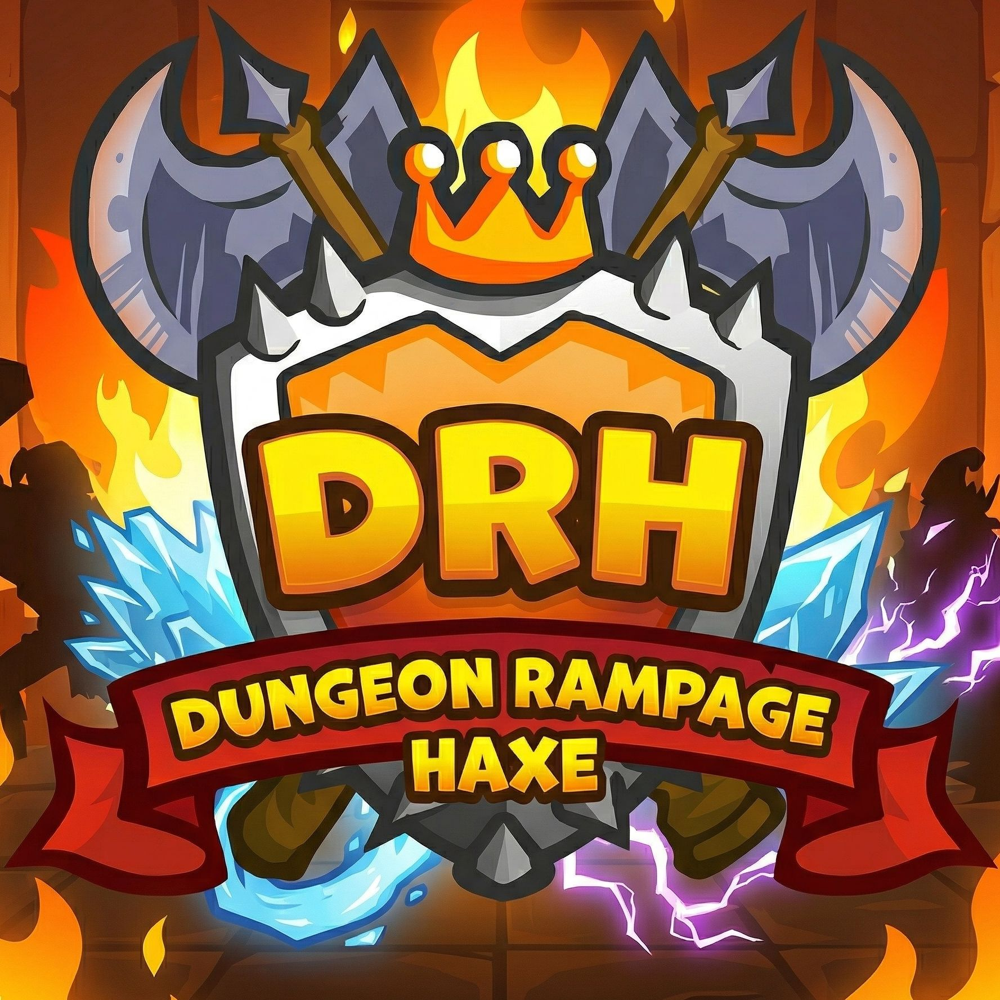

<p align="center">
  
</p>
<h1 align="center">Dungeon Rampage Haxe</h1>

<p align="center">
A smoother native port of Dungeon Rampage for Windows, Linux, and macOS,
with a configurable frame rate.
</p>

## Install and play

The recommended way to play DRH is
[DRH Launcher](https://github.com/Tutez64/DRH-Launcher), which handles DRH installation,
updates, repairs, and launch for you.

DRH Launcher also provides additional features such as launch option presets,
custom launch arguments, session history with logs and playtime, release history,
and more.

See the [DRH Launcher README](https://github.com/Tutez64/DRH-Launcher#readme)
for downloads and installation instructions.

You need to own the official
[Dungeon Rampage](https://store.steampowered.com/app/3053950/Dungeon_Rampage/)
on Steam and keep Steam open while playing. Otherwise, DRH cannot connect to the official servers.

## Why use DRH?

The official game can run poorly and suffer from input delay issues.
DRH supports a configurable frame rate, with 120 FPS as its built-in default, instead
of the official game's fixed 24 FPS. It usually provides much better performance,
especially in **Quality** mode, and avoids the input delay issue.

Like the official game, restarting before each new party is recommended because performance can degrade over time.

## Community

Join the [Discord server](https://discord.gg/VvWbNspZrQ) to discuss DRH and DRH Launcher,
get update notifications, and see occasional previews.

## Modding

Modding is not implemented yet. The living design document is
[docs/modding.md](docs/modding.md).

## Technical overview

DRH is a port of Dungeon Rampage from AS3/AIR
(see [Dungeon Rampage Decompiled](https://github.com/Tutez64/Dungeon-Rampage-Decompiled)) to Haxe.
It uses [OpenFL](https://www.openfl.org/), a graphical library that reimplements Flash/AIR APIs
with native targets and modern tooling.

This project required months of work, most of it in the following open-source projects:

- [JPEXS](https://github.com/Tutez64/jpexs-decompiler/tree/dev), the decompiler (see [Dungeon Rampage Decompiled](https://github.com/Tutez64/Dungeon-Rampage-Decompiled)).
- [ax4](https://github.com/Tutez64/ax4), my AS3 to Haxe converter based on ax3.
- [OpenFL](https://github.com/Tutez64/openfl), [SWF](https://github.com/Tutez64/swf), [Lime](https://github.com/Tutez64/lime), and [hxcpp](https://github.com/Tutez64/hxcpp).
- [SteamWrap](https://github.com/Tutez64/SteamWrap), used to replace the Steam ANE.
- [hxScript](https://github.com/Tutez64/hxscript), the in-process Haxe/cppia runtime for mods.

## Build from source

The project depends on forked versions of OpenFL, Lime, SWF, hxcpp, SteamWrap, and hxScript,
which are included as Git submodules.

### Requirements

- [Haxe](https://haxe.org/)
- A C++ toolchain supported by hxcpp
  - Windows: install the [Build Tools for Visual Studio](https://visualstudio.microsoft.com/downloads) (tick `Desktop development with C++`)

Install the regular haxelib dependencies:

```bash
haxelib install format
haxelib install hxp
```

### Clone the repository

```bash
git clone --recurse-submodules https://github.com/Tutez64/Dungeon-Rampage-Haxe
cd Dungeon-Rampage-Haxe
```

If you cloned without `--recurse-submodules`, initialize the submodules afterwards:

```bash
git submodule update --init --recursive
```

### Register the submodules with haxelib

The build resolves these libraries through haxelib. `haxelib dev` is required, and it
is global: two checkouts share one link. Run the commands from the repository root:

```bash
haxelib dev lime submodules/lime
haxelib dev openfl submodules/openfl
haxelib dev swf submodules/swf
haxelib dev steamwrap submodules/SteamWrap
haxelib dev hxcpp submodules/hxcpp
haxelib dev hxscript submodules/hxscript
```

### Rebuild helper tools

```bash
haxelib run lime rebuild cpp -debug
haxelib run lime rebuild tools
haxelib run lime rebuild hxcpp
haxelib run lime rebuild swf
```

SteamWrap:

```bash
cd submodules/SteamWrap
./setup.sh # .bat on Windows
./build # .bat on Windows
cd ../..
```

### Build the game

Lime reads `generated_swf_libraries.xml` when it parses `project.xml`, so
regenerate it before a `cpp` build (it lists `Resources/**/*.swf` plus the
preload/generate rules in `edits/swf_libraries/`).

The first native (`cpp`) build exports SWF fonts with
[JPEXS FFDec](https://github.com/Tutez64/jpexs-decompiler/tree/dev) (Java 8+).
Set `FFDEC_HOME`, put `ffdec` on `PATH`, or keep `jpexs-decompiler` next to this
repo. Later builds reuse `bin/obj/ffdec_fonts/`.

From the repository root:

```bash
haxe edits/swf_libraries/generate.hxml
haxelib run openfl build project.xml cpp
```

For a debug build, append `-debug`.

Replace `build` with `test` if you want the game to launch automatically after compiling.

Native builds accept `--fps auto` or `--fps <value>` to override the default
frame rate at launch. `auto` selects the first 24 FPS step at or above the primary display refresh
rate, up to 240 FPS, with a 120 FPS fallback. [DRH Launcher](https://github.com/Tutez64/DRH-Launcher) defaults to `auto`
and provides matching 24 FPS presets; manual values from 1 to 10000 are also accepted.

## License and disclaimer

Dungeon Rampage Haxe is an unofficial, fan-made project and is not affiliated
with, endorsed by, sponsored by, or authorized by the developers, publishers,
or other rights holders of Dungeon Rampage.

Dungeon Rampage and all original game code, assets, artwork, audio, characters,
trademarks, and other intellectual property belong to their respective rights
holders.

The GNU General Public License v3.0 or later included in this repository applies only to
original code and modifications created by Dungeon Rampage Haxe contributors,
to the extent that they hold the necessary rights. It does not grant any rights
to material originating from Dungeon Rampage or from other third parties.
Third-party components remain governed by their respective licenses.
