# DRH modding

Living design document. Not a user guide, a frozen schema, or an implementation commitment.

The game owns the runtime. The launcher owns the folder, enablement, and launch. Launcher-side catalog and install: [DRH Launcher architecture](https://github.com/Tutez64/DRH-Launcher/blob/master/docs/architecture.md) (Mods). This document is the source of truth for how mods load and talk to DRH.

## Open decisions

`open` = not decided. `recommended` = working direction. `decided` = frozen here. Notes stay short; the linked section has the rule.

| Topic | Status | Notes |
| --- | --- | --- |
| Fairness / `layers` | decided | No fairness police. `layers` dropped; taxonomy is `uses`. [Policy](#policy) |
| First-run disclosure | decided | Once in DRHL; `--play` gated like updates. [First-run disclosure](#first-run-disclosure) |
| API surface | decided | Facade `modding.*` (recommended) plus host `extends` / `replace` in v1. [API surface](#api-surface) |
| hxScript fork | decided | Lasting fork: classpath-entry scan + `replace`. [API surface](#api-surface), [Compilation](#compilation) |
| Mod kinds | decided | `uses`: `api` / `extends` / `replace`. Recommend `api`. [Mod kinds](#mod-kinds) |
| Enabled list | decided | `mods/enabled.json` + `--mods-dir`. No flag → no mods. [Passing the list](#passing-the-list) |
| Debug scan | decided | Same `--mods-dir`. Later optional: `--mods-all`, `--mod <id>`. No implicit scan next to the exe. |
| Lifecycle | decided | `onInit` before `new DBFacade()`, `onReady` before the loop, `onDispose` on `exiting`. [Lifecycle](#lifecycle) |
| hxScript `Environment` | decided | One shared world, one compile batch, package `mods.<id>`. [Compilation](#compilation) |
| Checksummed JSON overlay | decided | No extra warn/block. [Policy](#policy) |
| Game → launcher status | decided | `mods/last-run.json` + one log line per mod. [Last-run report](#last-run-report) |
| `mod.json` schema | open | Draft below, not frozen. |
| cppia bytecode cache | open | Future optimization, not v1. |
| Private / offline scripted gameplay | open | Out of scope while DRH only talks to official servers. |
| Distribution | decided | Pointer index we control; not a monorepo; not Thunderstore/Nexus as identity. [Distribution](#distribution) |
| Trust for updates | decided | Trust artifacts (`id` + version + SHA-256), not author repos. |
| v1 discovery UI | decided | Minimal catalog in DRHL, same index a later site can reuse. |
| Index schema / repo URL | open | Draft shape in [Distribution](#distribution). |
| Thunderstore / Nexus / itch as mirrors | open | Optional later; must not replace `mod.json` or the index. |
| Resource overlay rules | open | `Resources/` is composited at runtime; precedence, SWF vs JSON, and `Locale/` merge are unspecified. No separate `locale/` tree. |
| Type blacklist | decided | None. Interpreted and compiled see the same types. [Compilation](#compilation) |
| Host build (cppia) | decided | `-dce no`, force-include std, patch hxcpp, JIT on, first build verbose. [Compilation](#compilation) |
| Mod `id` and zip extract | decided | `id` = folder = package `mods.<id>`. Regex + keyword/reserved-name lists. No zip-slip, no size cap. [`mod.json`](#modjson) |
| `dependencies` cycles | decided | Not an error. Launcher warns, keeps user order inside the cycle. [Passing the list](#passing-the-list) |
| `import.hx` in a mod | decided | Skipped with a warning. [`mod.json`](#modjson) |
| `drh` in `mod.json` | decided | Always required. Closed tag-number string. Mismatch warns, does not block. [`mod.json`](#modjson) |

## Context

Dungeon Rampage Haxe (DRH) is a Haxe/OpenFL port, compiled natively with **hxcpp**. Official Dungeon Rampage is still moving (art overhaul, Starling for 1.0), so DRH internals will keep changing.

The script runtime is a **fork** of [hxScript](https://github.com/MeguminBOT/hxscript), pinned as [`submodules/hxscript`](https://github.com/Tutez64/hxscript): mods in ordinary Haxe, compiled **in-process** to cppia, no Haxe toolchain on the player's machine. Same model as the other submodules: rebase on upstream, stack our commits, PR immediately, do not wait for acceptance. Stock hxScript bridges whole packages (`-D hxscript_bridge_packages`). The fork adds the classpath-entry scan, the exclude list, and `replace`.

Constraints:

- hxcpp only (`project.xml`).
- Fully multiplayer on official servers. The client `sCode` fold is not a catalog special case ([Policy](#policy)).
- Updates replace `Dungeon Rampage Haxe/current/`. Mods live **outside** that directory.

## Architecture

```mermaid
flowchart LR
  subgraph publish [Publish]
    author["author zip + hash"]
    index["index repo"]
  end
  subgraph launcher [DRH-Launcher]
    catalog["v1 catalog"]
    modsDir["install-dir/mods/"]
    enabled["enable + load order"]
  end
  subgraph game [DRH hxcpp]
    host["modding host"]
    hxscript["one shared Environment"]
    cppia["compile cppia or interp"]
    api["public API"]
    gameCore["GameMaster timelines UI"]
  end
  author -->|"PR per version"| index
  index --> catalog
  catalog -->|"verify SHA-256"| modsDir
  modsDir --> enabled
  enabled -->|"--mods-dir + enabled.json"| host
  host --> hxscript
  hxscript --> cppia
  cppia --> api
  cppia -->|"extends / replace"| gameCore
  api --> gameCore
```



The launcher does not compile. It discovers mods, keeps the enabled set and load order, and passes `--mods-dir`. The game loads every enabled mod into **one** hxScript `Environment` (`mods.<id>`), compiles that world in one batch, and interprets what the emitter skips. Recommended path: `modding.*`. `extends` / `replace` are explicit, costlier kinds.

"Compiled" means `Compiler.compile(env)` inside the game process at load — not a rebuild of the DRH binary, and not a Haxe compile in the launcher.

| Role | Owns |
| --- | --- |
| Launcher | folder, index/catalog, enablement, `--mods-dir`, first-run disclosure. No Haxe toolchain. |
| Game | parse the flag, load, compile, lifecycle, `last-run.json`. |
| Author | zip + `mod.json`. Publish = PR to the index. Playing does not need the Haxe SDK. |

## Policy

DR is PvE, not a ladder. The official client is already leaky; DRH itself is a modified client. v1 does **not** reject mods for in-game advantage (exact HP, FOV, stacked-chest UI, chat macros, damage meters, client bugfixes).

How you hook is `uses` (`api` / `extends` / `replace`). A `layers` field (client / data / gameplay) was dropped: FOV is “client” and a large advantage; a mana-check patch sits in a weapon controller; it reopened the fairness debate.

**Official tables and `sCode`.** `Resources/Levels/DB_GameMaster.json`, `Resources/Combat/AttackTimeline.json`, and `Resources/Levels/library_server.json` feed `mSecurityGM` / `mSecurityTL` / `mSecuritySL`. The fold only counts runtime `"int"` fields; AttackTimeline is **shallow** (top-level keys of each attack: name, flags, `totalFrames`, the `frames` array object — not nested actions). `{ "type": "helloMod" }` does not change `mSecurityTL`. Timeline/library values are then `% 1097`. `blockCheater()` is only `Hero.BaseMove > 250` in the loaded GameMaster. `sCode` is sent on `ClientRequestEntry`; server use is **unknown**. A mismatch would at most fail dungeon entry (`ResponceCode != 0`). It is not an automatic ban in the client.

v1 does **not** warn or block those three paths in the index, the launcher, or the host. An indexed mod was reviewed and plays; sideload is already labeled unreviewed. Index review still refuses or yanks malware and combat bots / protocol spoof.

## First-run disclosure

DRHL shows this **once** (launcher config) the first time the user would actually use mods: first enable, or first Play with a non-empty `enabled.json`. Do not nag every launch. **`--play`** with a non-empty `enabled.json` and no confirmation yet opens the **full UI**, like an available update. Browsing the catalog does not require it. Not an EULA lecture: one line that DRH is already a modified client is enough.

1. **Code in-process.** Haxe/cppia inside the game, not a skin pack. Index review is human, not a proof. Sideload is weaker.
2. **Official servers.** Same as vanilla DRH. No promise about bans either way.
3. **Updates.** `api` mods follow `api: N`. `extends` / `replace` can break on a DRH update with no `api` bump. A modded session is not supported like vanilla.
4. **Several mods.** `replace` on the same rewritten surface can clash. Load order is in the launcher.
5. **Back to vanilla.** Disable all mods / Play with an empty list. Nothing is written into `current/`.
6. **EULA / blessing.** Like DRH, this is not the official Steam client; rights holders do not endorse it.

## API surface

hxScript is ordinary Haxe in-process, not a JS-style "patch any function" runtime. `private` / `inline` / `final` methods, and a comparison buried inside a compiled function, stay out of reach.

**v1 is facade + host types.** The facade is the recommended path. `extends` / `replace` exist so a mod can still reach what wrappers do not cover. That power is a v1 foundation. Both land in the **hxScript fork**. The `submodules/hxscript` commit is the pin, rebased on upstream, PR'd once it works for DRH. The build finds it through `haxelib dev`. hxScript's compiler is BETA; `replace` touches bridge generation and the emitter, so rebases will conflict more than on lime/openfl. Accepted: the goal is a clean `replace`, not the smallest diff.

- **Facade (`modding.*`).** Boot lifecycle (`onInit` / `onReady` / `onDispose`), gameplay events (`heroSpawned` / `heroDespawned` / `floorEnter` / `floorExit`), overlay/HUD root, input, and a window on live state through wrappers (`ModHero`, floor, inventory, camera, chat — names TBD). Not raw `HeroGameObject`. Wrappers that need a hero or floor stay empty until the matching event. Wrappers + those events are what `api: 1` promises across DRH tags; Starling may reimplement them without bumping `api` if the wrapper contract holds.
- **Host types (fork).** Two features, both required for v1:

### Bridges

A scriptable base is any eligible class that ships as **game or engine code**: DRH's own source roots and the vendored engine. Not bridged: the **toolchain** (hxcpp, hxScript, Haxe std) and haxelibs the engine uses internally (`format`). A curated allow-list puts the burden of proof on the wrong side.

| Root | Package(s) | In / out |
| --- | --- | --- |
| `src/` | 35 packages incl. vendored `box2D`, `org`, `com`, `generatedCode` | in — the game |
| `src-steam/` | `com.amanitadesign.steam` (FRESteamWorks shim, `if="cpp"`) | in — DRH code; `replace(FRESteamWorks, …)` intercepts Steam calls |
| `compat/` | `compat.*` plus 15 **root-level** files (`ASCompat`, `ASDictionary`, `ASProxyBase`, …) | in — DRH code. Abstracts (`ASAny` / `ASObject` / `ASFunction`) and macros drop out via `eligible()` / `*.macro.hx` |
| `submodules/openfl` | `openfl` | in — display list (`Sprite`, `MovieClip`, `Bitmap`, `TextField`, …) |
| `submodules/lime` | `lime` | in — windows / input / timing |
| `submodules/swf` | `swf` | in — Animate symbols and timelines |
| `submodules/SteamWrap` | `steamwrap` | in — binding under `src-steam`; mostly `@:cffi` / statics, near-zero cost |
| `submodules/hxcpp` | — | out — C++ runtime / build tool. `cpp.*` lives in the Haxe std |
| hxScript (`-lib hxscript`) | `hxscript` | out — the loader, not game content. `replace(Environment, …)` would rewrite the loader that loaded the mod; `compile.*` / `cppia.*` bridges break on every rebase |
| Haxe std, `cpp.*` | — | out of the *bridge* scan — presets handle the std; `cpp.*` is almost all `extern` / `abstract` / `@:coreType` |
| haxelib `format` | `format` | out — used from Lime / OpenFL / swf internals, never from `src/`. Add it the day someone has a use |

"Not bridged" means **no `extends`**, not "unreachable": a mod can call any host static (`cpp.vm.Gc.run`, …). The GC *algorithm* is C++ / compile-time defines, out of reach by nature. What keeps unreferenced std members in the binary is DCE / include, not bridging ([Compilation](#compilation)).

One default exclusion: **`DungeonBustersProject`**. Lime's `ApplicationMain` constructs it **before** the host exists (the host runs inside its constructor), so `replace` is impossible and `extends` would be a second application. Its bridge would be the whole `Sprite` surface through `GameEntry` for a use that cannot exist. The other two `src/` root classes (`Loading_screen_swf`, `Db_UI_skip_button_swf`) stay in: they go through `ASCompat.createInstance`, which consults the `replace` table.

Whole submodule trees are bridged (`openfl._internal`, Lime backends included). Stock hxScript's thin OpenFL preset (`Sprite` only) is a size default, not a limit. **Measure first:** the first cppia build records binary size and build time; the lever if it is too fat is `hxscript_bridge_exclude`, not `final` on DRH types one by one.

The fork keeps upstream `Bridges.eligible`. Four rules are Haxe; two are scan filters:

| Kind | Source | Why skipped |
| --- | --- | --- |
| `final class` | language | Haxe forbids the subclass. Un-`final` a type we own if it must be extendable (kills hxcpp de-virtualisation on that type). In `src/` only vendored helpers (`com.greensock`, `com.adobe`, `com.wildtangent`), `AssetCache` and `RootFacade` are `final`. |
| `extern class` | language | No Haxe body. Scripts can still *call* it. |
| `interface` | language | Not a class base. Scripts **`implements`** a native interface already. |
| `private class` | language | Invisible from a mod package. Make it `public` in DRH if a mod needs it. |
| generic class (`Foo<T>`) | `eligible()` | Haxe allows `extends Foo<Int>`; the generated bridge cannot substitute the erased parameter. DRH has no generic class; v1 does not lift this. |
| class without its own constructor | `eligible()` | Conservative: generator already handles inherited `super`. In DRH the only such class is `RootFacade`, already `final`. Lever = the filter, not an explicit `new` added to DRH. |

`-D hxscript_bridge_types` also goes through `eligible()`; only the presets' curated bases skip it. `-D hxscript_verbose` names every skipped module and why.

`final` / `inline` **methods** on an otherwise scriptable class still cannot be overridden.

Do not hand out internal instances as the stable API. A HUD that peeks `actor.HeroGameObject` is an `extends` mod, even if it only reads fields.

### `replace`

Explicit `replace(HostClass, Sub)` so host `new HostClass(...)` constructs the subclass. **`extend` is not `replace`.** `class HudIcon extends Sprite` is a widget; it does not steal OpenFL's `new Sprite()`. Only `replace(Sprite, …)` would. Same rule for every type, including OpenFL/Lime: no special blacklist.

Disjoint-method merge lives in hxScript; DRH calls `replace` and gets one class or a conflict. A `new` rewrite does not see dynamic instantiation. DRH's own goes through **`ASCompat.createInstance`** (`compat/ASCompat.hx`): `AssetRepository`, the loading clip, the skip button, every `var X:Dynamic = SomeClass` pattern. The host makes `createInstance` consult the same `replace` table. That function is `inline`, so the lookup goes **into its body**; a runtime wrap would miss every already-inlined call site. Outside: Lime's `Type.createInstance` (e.g. `AnimateLibrary` from the asset manifest) — `extends` works, `replace` does not.

- Off by default: a type is replaceable because a mod registered it, not because it is scriptable or because a script `extend`s it.
- Any number of mods may `extend` without `replace`. Several `replace` on the same base are OK if rewritten methods/fields/`new` do not overlap. Overlap → error or explicit priority. Residual risk: `A.update` can call `this.onWeaponDown()` and hit `B`'s override on the same instance. A wrap/`callNext` chain is how you *intentionally* stack one method. Out of scope to prove disjoint `this` use statically.

### Versioning

- Only `modding.*` wrappers are the **stable** API. `facade.DBFacade`, `actor.*`, `combat.*`, `uI.*` are host types: usable via `extends` / `replace`, not covered by `api` compatibility.
- Version the facade (`api: 1`) **independently** of the DRH tag (`V20`). **Adding** wrappers without changing existing ones stays `api: 1`. Mods that need the new bits set `drh` so the smallest tag in the set is that release. Bump `api` only when an existing wrapper's contract breaks. A bump to `api: 2` would force every older HUD to update for no reason.
- A Starling landing that breaks the **wrapper** contract is an API bump; internals moving behind wrappers is not.
- Official examples in the repo for all three kinds, rebuilt on every bump.

## Mod kinds

Recommend **`api`**. The other two exist because the facade will not cover everything at first.

| Kind | What it means | DRH versions | Other mods |
| --- | --- | --- | --- |
| `api` | Uses only `modding.*` (wrappers, events, overlay root). OpenFL/Lime for drawing on that root is OK; `actor.*` / `combat.*` / `facade.*` are not. | Tied to `api` in `mod.json`. Same or backward-compatible facade → expected to keep working across DRH tags. | Best. No `replace` occupancy. |
| `extends` | Subclasses or calls **host** types but does **not** `replace` vanilla `new`. Helpers, `new MyRepeater()`, reading public internals. | Tied to those class/method names. Starling / conversions can break it even if `api` is unchanged. | Usually fine with others. Still shares live objects with a `replace` on the same type (`is RepeaterWeaponController` remains true). |
| `replace` | Explicit `replace(HostClass, Sub)` at `onInit`. Host `new HostClass(...)` becomes the subclass (merge if rewritten methods/fields/`new` are disjoint). | Same host-type fragility as `extends`, plus construction. | Conflicts when rewritten surfaces overlap. One occupancy per method/field/`new`. |

A mod may list several kinds (`uses: ["api", "replace"]`). Catalog / index show the **strongest** present: `replace` > `extends` > `api`. Index review checks the declare matches the code (honor + grep). Sideload can lie; label it.

Players see a short warning on `extends` / `replace` (may break on game updates; `replace` may clash), not a fairness lecture.

## Lifecycle

Part of the `api` contract. The three methods are **boot** hooks; names are frozen. Two anchors: `onInit` = nothing of the game exists yet; `onReady` = every singleton exists (tables, account, inventory, clock, network) and the loop is about to start. Neither means "a hero is on screen": live moments are **events**.

`mod.json` `entry` extends `modding.Mod`. All three methods are optional (empty defaults).

| Method | When | Typical use |
| --- | --- | --- |
| `onInit(ctx:ModContext)` | `DungeonBustersProject` constructor, after `--mods-dir` parse + compile, **before `new DBFacade()`**. Process and `stage` are up; **nothing of the game is constructed** (no facade, no `Logger`, no clocks, no camera, no state machine, no `FRESteamWorks`; `FeatureFlags` does not exist yet and its values come later anyway). | `replace(...)`, subscribe, draw on the overlay root `ctx` hands out (host places it with `addRootDisplayObject`). State wrappers empty. Read feature flags in `onReady`. |
| `onReady(ctx:ModContext)` | `LoadingFinishedEvent`, inside `DBFacade.architectureLoaded`, after `mDBAccountInfo` is set and `gameClock.initTime()`, **before `run()` and `mainStateMachine.start()`**. Tables, account (inventory, active avatar, friends), feature flags (CLI + config), matchmaker, server time, clock are up; the loop has not ticked. No town, hero, or floor. **Once** per process. | Read tables and account-level wrappers. Closest to Unity `Start`. Hero / floor wrappers stay empty until the matching event. |
| `onDispose()` | `NativeApplication` **`exiting`**, registered at the **top** of the constructor (before compile, ahead of the game's listener, so it runs **before `mSteamworks.dispose()`**). Once, reverse load order. Every graceful exit (window close, `WM_CLOSE`, `SIGTERM`, Cmd+Q, Quit, socket error). The launcher's Stop force-kills after **3 s**. Not called on a crash, a force-kill, or if the loop never pumps the quit (compile stuck, hung frame). | Timers, listeners, flush a local file. No network, no waiting. Must not block exiting. |

`onInit` is before `new DBFacade()` because that is the only placement where **`replace` covers every host `new`**. HUD, sound, Steam Input and `MainStateMachine` are built later (`stagetwo_init`, `buildEngines`, `createHUD`); an `onInit` at the end of `onInvoke` would already see them. What it would miss is field initialisers and `Facade.init`: **`FRESteamWorks`** (`mSteamworks = new FRESteamWorks()` runs inside `new DBFacade()`, before `init()`), both `GameClock`s, `EventManager`, `Camera`, work managers, letterbox, loading clip. A second early hook would be a second "what exists here" list, and that list moves with Starling. Steam identity and the auth ticket are readable from `onReady`; feature flags are only complete after `LoadingState.configReady`. `AssetRepository`, the loading clip and the skip button go through `ASCompat.createInstance` (same `replace` table).

`onReady` is `LoadingFinishedEvent`, not `ManagersLoadedEvent`, because the facade promises an **inventory** wrapper and inventory is account data. At `ManagersLoaded` the tables are in and the account / matchmaker / `initTime()` are not. Mutating GameMaster before the account is parsed against it is the additive `tablesLoaded` event, not a fourth method.

**Order:** `onInit` → (`tablesLoaded`) → `onReady` → any gameplay event. Town / tutorial dungeon is entered by the `mainStateMachine.start()` that follows `onReady`, so no `heroSpawned` / `floorEnter` can precede it.

**Boot that never reaches `onReady`:** `SocketErrorState` (service discovery failed) and `blockCheater()` — `ManagersLoadedEvent` never fires. Mods must tolerate a missing `onReady`; `last-run.json` records `ready: false`. An account with **no active avatar** is *not* that case: `MainStateMachine.start()` logs and returns, but it runs **after** `onReady`, so `ready: true` and no town. Wait for `heroSpawned`, do not infer a hero from `onReady`.

**Return to town (`ReloadTownState`) is not a second `onReady`.** That is additive `townEnter`.

Host obligations:

- **Overlay root stays on top.** Root z-order is `Facade.addRootDisplayObject(child, layer)` (letterbox at 1000, loading clip at 0), not `stage.addChild`. A child added during `onInit` is unknown to `mChildLayer` and counts as layer 0, so the letterbox lands above it. After `DBFacade.init` the host re-registers the overlay above the letterbox. Authors do not manage z-order against vanilla.
- **No `Logger` during `onInit`.** `Logger.init` runs inside `Facade.init`. The host buffers compile / `onInit` logs and flushes them, or uses `trace`.
- **Throw isolation.** Move the game's `uncaughtError` listener to the **top** of the constructor (null-guard `mDBFacade`) so compile, `onInit` and `new DBFacade()` are inside it. That listener catches event-dispatch errors, not a synchronous throw in the constructor chain: the host still wraps each mod's compile and `onInit` in try/catch. Isolation is the `modding.*` contour (`onInit` / `onReady` / facade event handlers). A throw in `onDispose` is logged and ignored. A throw from a **replaced host method** is a host throw. A `replace` subclass whose **constructor throws while `new DBFacade()` or `init()` constructs it** kills the boot. Accepted. `last-run.json` is written right after `onInit` (`ready: false`); the launcher's "process exited + `ready: false`" reading covers it.
- **Startup cost.** Parse + compile of every enabled mod happens before the first frame (hxScript: ≈10 ms per module). Measure with real mods. If it becomes a visible black window, the fix is a splash **before `new DBFacade()`** (OpenFL preloader, or a Lime-level clip), not a split of `init()`: `new DBFacade()` already constructs `FRESteamWorks`. A bytecode cache is the later lever.

### Gameplay events (`api: 1`)

Subscribe from `onInit` or `onReady`. Host-emitted; not existing game `Event` class names. These four are frozen so facade mods can hook the live world (local + other players, town + dungeon, floor-scoped teardown) without `extends`. Adding an event later is not a bump; changing one of these is.

| Event | When | Typical use |
| --- | --- | --- |
| `heroSpawned` / `heroDespawned` | A hero (local **or** other players) enters / leaves the world. Town and dungeon. | Per-hero overlay or roster. |
| `floorEnter` / `floorExit` | A dungeon floor starts / ends. Not town. | Floor-scoped UI or counters; teardown on exit. |

Pattern: subscribe in `onInit`, read tables and account in `onReady`, react to spawn/floor for anything with a hero in it. Do not assume a hero exists in `onReady`.

Additive (not frozen):

| Event | When |
| --- | --- |
| `tablesLoaded` | `ManagersLoadedEvent`: tables in, account not yet parsed against them. Window to mutate tables (`extends` use). |
| `townEnter` / `townExit` | `TownState` entered / left, including `ReloadTownState`. |
| `hudReady`, inventory, chat, … | As the facade grows. |

`ModContext`: overlay root, log, `replace`, event subscribe, state window (account-level wrappers filled from `onReady`; hero/floor wrappers after the matching event). Load order follows `enabled.json`. Outcomes land in [last-run.json](#last-run-report).

## Disk layout

Mods live outside `Dungeon Rampage Haxe/current/`, so they survive updates and rollbacks.

```text
<install-dir>/
  data/
  Dungeon Rampage Haxe/
    current/          # game, replaced on every update
    previous/         # launcher rollback
  mods/
    enabled.json      # launcher-owned: enabled ids, load order (dependencies first)
    last-run.json     # game-owned: last session outcome per mod
    some_mod/         # folder name = id
      mod.json
      src/            # .hx sources; package mods.some_mod (+ subfolders); no import.hx
        Main.hx       #   package mods.some_mod;
        ui/Panel.hx   #   package mods.some_mod.ui;
      Resources/      # non-destructive overlay (including Locale/)
```

`<install-dir>` is the launcher managed content root (not the launcher executable). Linux default looks like `~/.local/share/DRH Launcher`.

**No destructive overlay** in `current/Resources/`. The game composites mod resources over vanilla at runtime. The launcher does not copy, patch, or verify files inside the game install. Merge rules are still [open](#open-decisions).

## Passing the list

The game cwd is `Dungeon Rampage Haxe/current/`. Enablement must not live in `current/` (wiped on update) or inside each `mod.json` (author artifact).

The launcher writes `<install-dir>/mods/enabled.json`:

```json
{
  "mods": [
    { "id": "example_hud" },
    { "id": "chat_macros" }
  ]
}
```

Array order is load order. The launcher writes it so every mod comes **after** its `dependencies`; the user's order is kept where the graph leaves it free. Disabled mods are omitted. If an enabled mod's dependency is not enabled, the launcher warns and still writes the file; the game loads the mod and missing types surface as that mod's compile / parse failure.

**Cycles** are not an error. Sort on strongly connected components: a cycle is one block against the rest, user order **inside** it, warning naming the members (`a ↔ b: load order between them is yours`). Enabling is never refused. In one shared batch, mutual imports compile; the only undefined thing is which `onInit` runs first. The host never sorts; it follows `enabled.json` as written.

If an id in `enabled.json` has no folder / no `mod.json`, the game **skips** it, logs, and records `skipped` in `last-run.json`. It does not abort boot. On the Mods page scan (not during `--play`), the launcher drops those ids and rewrites the file.

On Play the launcher passes **`--mods-dir <absolute path to mods/>`** (quote paths with spaces). The game parses it from `Sys.args()` in the constructor, like `--fps`. Then it reads `enabled.json` and resolves each `id` to a directory (scan `mod.json` if the folder name differs). Missing or empty `enabled.json` → load nothing (same as an empty list). Prod CLI does **not** list ids (Windows command-line length, quoting). Session logs already capture the flag.

No `--mods-dir` → **no mods**. Intentional vanilla.

Debug: the same flag. Later optional `--mods-all` (ignore `enabled.json`) and `--mod <id>`. No environment variables (the launcher sanitizes env; wrappers like `prime-run` make that channel unreliable).

## Last-run report

When `--mods-dir` is set, the game writes `<install-dir>/mods/last-run.json`. Without the flag, it writes nothing. The session log is not a Mods-page UI.

Draft, not frozen:

```json
{
  "drh": "20",
  "started": "2026-09-15T13:20:00Z",
  "ready": true,
  "mods": [
    {
      "id": "example_hud",
      "version": "0.1.0",
      "status": "ok",
      "mode": "compiled"
    },
    {
      "id": "broken_replace",
      "version": "1.0.0",
      "status": "failed",
      "mode": "interpreted",
      "error": "replace overlap on RepeaterWeaponController.onWeaponDown"
    }
  ]
}
```

| Field | Role |
| --- | --- |
| `drh` / `started` | Tag-number string of the game that wrote the file (`"20"`, no `V` — same space as `mod.json`) and UTC start time. The launcher compares `started` with the Play time **it** recorded; `started` alone cannot reveal a crash before the first write (the previous run's file is still there). |
| `ready` | `false` until `onReady` has run; stays `false` when boot never gets there (`SocketErrorState`, `blockCheater()`). A mod `ok` with `ready: false` only got `onInit`. While the game is still loading the file also says `false`; the launcher disambiguates with process state (alive → loading, exited → boot stopped before `LoadingFinished`). No active avatar still reports `true`. |
| `status` | `ok` / `failed` / `skipped` (id in `enabled.json` but folder, `mod.json`, or valid `id` missing) |
| `mode` | `compiled` or `interpreted` (skip reason in `error` when the emitter skipped) |
| `error` | Present on `failed` / interpreted-with-reason / `replace` overlap. One line; full stack stays in the session log. |

Write after compile + `onInit` (`ready: false`). Rewrite after `onReady` (`ready: true`, plus any `onReady` failure). Update the same file if a later `replace` conflict happens. A crash before the write leaves the previous file; treat it as stale, not live IPC. A missing file (first launch, or crash before the first write) is the same as a stale `started`.

The launcher reads it when the Mods page is shown. That is where replace overlap becomes visible for **that** mod.

At load, one `Logger.info` per enabled mod (`id`, `version`, `uses`, `mode`, skip/fail reason). The session log already captures stdout.

Out of v1: in-session toasts, a pipe back to a running launcher.

## `mod.json`

Draft. Shared launcher/game contract, not frozen.

```json
{
  "id": "some_mod",
  "name": "Some Mod",
  "version": "0.1.0",
  "author": "example",
  "api": 1,
  "drh": "20",
  "entry": "Main",
  "uses": ["api"],
  "dependencies": []
}
```

| Field | Role |
| --- | --- |
| `id` | Stable identifier, install folder, and the mod's **package**: every source file is in `mods.<id>` or a sub-package. Must match `^[a-z][a-z0-9_]{1,62}[a-z0-9]$` (3–64, snake_case, letter start, no trailing underscore) and must **not** be a Haxe keyword or a Windows reserved device name. Index CI, launcher install, and host skip all apply the same regex + lists. Display name stays in `name`. |
| `name` | Display name |
| `version` | Mod version |
| `author` | Author |
| `api` | `modding.*` contract version. **Required** if `uses` contains `api`; omit when the mod is only `extends` / `replace`. |
| `drh` | **Always required.** Tag numbers this artifact was built/tested for (no `V`, no `>=`). `"20"`, `"20,21"`, or `"20-22"` (closed, inclusive). The launcher never blocks Play or enablement on a mismatch; it **warns**: installed tag **older** than the set's minimum (all kinds); installed tag **newer** than the set's maximum — `extends` / `replace` only (`api`-only trusts `api: N` forward). |
| `entry` | Short class name, resolved as `mods.<id>.<entry>` (e.g. `Main` → `mods.some_mod.Main`, extends `modding.Mod`). Cannot name anything outside the mod's package. |
| `uses` | One or more of `api`, `extends`, `replace` |
| `dependencies` | Ids whose script types this one imports. **Ids only, no versions.** Launcher orders `enabled.json` and warns when one is not enabled. No auto-install, no version solving. May be empty or absent. A cycle is not an error ([Passing the list](#passing-the-list)). |

Haxe keywords (the regex alone lets `package mods.new;` through): `abstract`, `break`, `case`, `cast`, `catch`, `class`, `continue`, `default`, `dynamic`, `else`, `enum`, `extends`, `extern`, `false`, `final`, `for`, `function`, `implements`, `import`, `inline`, `interface`, `macro`, `new`, `null`, `operator`, `overload`, `override`, `package`, `private`, `public`, `return`, `static`, `switch`, `this`, `throw`, `true`, `try`, `typedef`, `untyped`, `using`, `var`, `while`.

Windows reserved device names (the folder cannot be created): `con`, `prn`, `aux`, `nul`, `com1`–`com9`, `lpt1`–`lpt9`.

**Package rule.** hxScript requires the package the host passes to match the file. The host derives it from the path under `src/`: `mods/<id>/src/ui/Panel.hx` is `mods.<id>.ui`, `src/Main.hx` is `mods.<id>`. A file that declares anything else is hxScript's parse error; the module declares nothing; the mod is `failed`. Ids are unique (index) and the host refuses a second mod with the same `id` (sideload), so two mods can never declare the same type — otherwise the interpreter silently replaces the earlier module (`Environment.modules`) and hxcpp's cppia class table overwrites (last wins). `mods.` also keeps a mod from shadowing a host or engine root (`combat`, `com`, `openfl`, …).

**`import.hx` is not supported (v1).** The host skips it with a warning attributed to the mod (`import.hx ignored`); other files still load. hxScript's prelude (`ImportModule`) is host-wired and interpreter-only; the cppia emitter reads a module's own `import`s only, so honouring it would silently interpret every file of that mod. Fed as a normal module it would fail the package rule (no `package` line). Each file lists its imports. Lifting this later is additive if hxScript teaches the emitter about preludes.

**Using another mod's types is `extends`-fragile.** `import mods.cool_lib.Api` breaks when `cool_lib` changes it. v1 does not pin versions between mods; authors coordinate. The facade remains the stable surface.

The launcher refuses to install (index or local zip) if `id` fails the regex / lists, and extracts to `mods/<id>/` with the same path rules as game releases (`enclosed_name` / `safe_relative_path`: no `..`, no absolute paths, files and directories only). No uncompressed size cap: index artifacts already have size + SHA-256; sideload is a file the user picked. A hand-copied folder whose directory name differs from `id` can still be scanned via `mod.json`; a bad `id` is skipped (game) or not a mod (launcher).

A directory without `mod.json` is not a mod.

## Distribution

Three roles, kept separate so a nicer front can land later without moving mods:

| Role | v1 | Later |
| --- | --- | --- |
| Discussion | Discord | still Discord |
| Listing (source of truth) | Index repo we control | same index |
| Files | Author-hosted zip (e.g. GitHub Release) | same, plus optional mirrors |
| Human catalog | **Minimal list in DRHL** | polish in DRHL and/or a website reading the same index |

The index **points**. It does not contain community mods. Official example mods may live in the DRH tree; third-party mods do not.

A listing is an **artifact**, not a repo: `id + version + sha256 + download URL + api + drh + uses`. Trusting `github.com/alice/cool-hud` forever would auto-approve the next Release. Reviewing "the repo" once does not review v1.2. A new version is not visible until it is a new index entry (PR). CI can check that the zip opens, `mod.json` matches, and the hash is correct; a human still diffs against the last indexed version. **Auto-ingest of GitHub Releases without the index is out.**

Sideload (Open mods folder / install from zip) stays, labeled unreviewed.

Thunderstore, Nexus, itch.io are **not** the identity of a DRH mod. They may become mirrors of the same zip with a generated extra manifest. Nexus is the weakest legal fit for a fan port. Steam Workshop is out of scope (DRH is not a Steam app).

The Mods page (fetch, install, enable, order, `last-run` display) is specified in the launcher architecture. This document owns the shared files and `--mods-dir`.

### Index entry (draft)

Not frozen. Enough to implement a launcher list:

```json
{
  "id": "some_mod",
  "name": "Some Mod",
  "version": "0.1.0",
  "author": "example",
  "description": "Short summary for the catalog.",
  "api": 1,
  "drh": "20",
  "uses": ["api"],
  "dependencies": [],
  "url": "https://github.com/example/some-mod/releases/download/0.1.0/some-mod-0.1.0.zip",
  "sha256": "...",
  "source": "https://github.com/example/some-mod"
}
```

`source` is documentation (issues, code), not a download pipe. Yanking a version is an index change (tombstone or removal).

Out of v1, same index: ratings, galleries, collections, dependency *solving* (versions / auto-install), in-launcher publishing, a separate website.

## Compilation

hxScript parses `.hx` at runtime. On hxcpp a module can become [cppia](https://haxe.org/manual/target-cppia.html) loaded as a real class. The interpreter is the default and the safety net: anything the emitter cannot express is skipped with a reason and stays interpreted.

Intended game build flags (`hxscript` = **our fork**):

```text
-lib hxscript
-D hxscript_cppia
-D scriptable
-D hxscript_host=modding
-D hxscript_bridge_classpath=src,src-steam,compat   # fork: classpath entries walked with an empty package
-D hxscript_bridge_exclude=DungeonBustersProject    # more only after measuring
-D hxscript_bridge_packages=openfl,lime,swf,steamwrap   # stock; whole trees until measured
-dce no                                              # hxScript's own cppia setting
--macro include('haxe', true, ['haxe.macro'])         # DRH: force-type the std; ignore list grows with what fails on hxcpp
--macro include('sys', true, ['sys.db'])             # sys.db is @:cffi over hxcpp sqlite/mysql
-D hxscript_keep=cpp.vm.Gc,cpp.vm.Profiler           # cpp.* by name (package has objc / link)
```

**Bridge scan (fork).** Submodules each have one root package, so stock `-D hxscript_bridge_packages=openfl,lime,swf,steamwrap` covers them (recursive; presets' ignore lists do not apply). DRH's own roots need a **classpath-entry scan** — walking the empty root would include the std — so the pinned fork has `-D hxscript_bridge_classpath=src,src-steam,compat` and `-D hxscript_bridge_exclude`. Necessity is `compat/` (root-level types no package scan can reach); for `src/` alone a 35-package list would do. The define names **classpath entries** walked with an **empty package**, not a package called `src` (`modulesUnder("src")` would look for `src/src/` and emit `src.actor.Hero`). The walk skips `*.macro.hx`. `-D hxscript_host=modding` stays upstream's meaning: packages scanned for `@:scriptAmbient` / `@:scriptStatic`. `-D scriptable` is hxcpp's cppia flag; it does not generate extend bridges.

If the first verbose build is too fat: exclude `openfl._internal` and Lime backends first, then consider narrowing to display roots (`openfl.display`, `openfl.text`, `openfl.geom`, `openfl.events`) plus named types.

**DCE.** DRH and Lime's cpp templates pass no `-dce`, so the build is Haxe's default **`-dce std`**: unused *standard library* members are stripped; game / OpenFL / Lime / swf / SteamWrap never were. The host switches to **`-dce no`**. That is hxScript's cppia position (`-D scriptable` resolves host classes by name at load; DCE removes whatever no compiled call site references). Its probe: 42 of 83 commonly-scripted std members unreachable under `-dce std`, 3 under `-dce no`. `hxscript_keep` as the *primary* mechanism is the same curated list we rejected for bridges.

`-dce no` keeps what is **typed**; it does not type what nothing references. A mod calling `haxe.crypto.Sha256` when nothing in the host names it gets `Type not found`. Libraries are already covered (Autowire + the bridge scan). The std is the gap. DRH goes **further than hxScript** and force-includes it: `--macro include('haxe', true, ['haxe.macro'])` and `include('sys', true, ['sys.db'])`. `sys` is 34 modules and Lime already types most of them; the net addition is `Http`, `FileStat`, thread pools, `EventLoop`, `Condition`, `Semaphore`, `ssl.Digest`. `sys.db` is excluded up front (`Sqlite` / `Mysql` need linking). Expect the `haxe` ignore list to grow at the first build. `cpp.*` is **not** included wholesale (`cpp.objc`, `cpp.link`); name what a mod may want via `-D hxscript_keep`. Cost is mostly **build time** (one `.cpp` per class). If it hurts, grow the ignore list; never return to `-dce std`.

**hxcpp.** Patched with `patches/apply-hxcpp.py` on `submodules/hxcpp`.

**JIT.** `cpp.cppia.Host.enableJit(true)` once, process-wide, **before** any module loads. If we compile, we jit. A known hxcpp JIT segfault on `'' + (n == 1)` is in the same patch set.

**Size / time.** Real binary cost: `-D scriptable`, OpenFL/Lime/swf bridges (`DisplayObject` has a large method surface; swf ~240 modules; SteamWrap / `src-steam` / `compat` are negligible), and the `src/` classpath bridges. `-dce no` plus the std include is mostly build time. Measure a first cppia build against current DRH before treating compiled mods as free.

**No type blacklist.** Do not set `-D hxscript_sandbox`. Interpreted and compiled resolve the same types.

The compiled path is not automatic: the host must call `Compiler.compile(env)` and wire `Compiler.ambient` / `Compiler.statics` (hxScript trap: interpreter ambients are not the compiler's).

**One world, one batch (v1).** All enabled mods go into a single `Environment` and a single `Compiler.compile(env)`. That is what lets a mod import another's types *and* stay compiled: cppia resolves a class either inside the module being loaded or as a host class; a scripted class in another batch is neither. Inside one batch, every module is declared before any is emitted. Price:

- **Skips cascade.** If `mods.cool_lib.Api` is refused, every module naming it is skipped too. A parse error in `cool_lib` means it declares nothing and dependents fail at import. `dependencies` makes that visible; it does not remove the coupling.
- **Blast radius of `Module.boot()`.** A loader reject splits the batch (`narrowOnFailure`, default on) until the bad module is left interpreted. The rest still compile. Per-mod worlds would confine that and forbid compiled inter-mod use.
- **No selective unload.** Dropping the world drops all mods. v1 does not unload.

Name collisions are excluded by the [package rule](#modjson), not by isolation.

Bytecode cache (cppia bytes on disk, invalidated when the game version, `mod.json`, or sources change) is a future optimization, not what makes mods "compiled".

## Starling / 1.0

Vanilla code will follow DR.

- **`api` mods** must not depend on internal packages. Wrappers stay the contract. Internals can move with no `api` bump if wrappers hold; a wrapper break **is** a bump.
- **`extends` / `replace`** depend on host types. They can break on Starling without an `api` bump. `drh` is how the launcher warns (not a hard refuse).
- The game still tries to load; failures go to `last-run.json`.

## Technical prerequisites

Needed before a real host; not a restatement of the rules above.

1. **Done**. Patch hxScript. Except `replace` which is still missing. Further generator fixes may still show up on the first cppia build.
2. **Done.** hxcpp cppia patch.
3. First cppia build: `-D hxscript_cppia`, `-D scriptable`, `-D hxscript_verbose`, `-dce no`, std includes, `enableJit(true)` before loading mods. Fill ignore lists from what fails.
4. Implement `src/modding/` per this document (`uncaughtError` / `exiting` at the top of the constructor, `--mods-dir`, one world, lifecycle, overlay re-register, `ASCompat.createInstance` → `replace` table). Bake the release tag number (no `V`) into the host so `last-run.json` can write `drh`.
5. Launcher: index fetch, catalog install, `enabled.json`, `--mods-dir`, `last-run.json` display — no destructive overlay.
6. Index repository (separate from DRH / DRHL), PR + CI for new versions.

## Out of scope for this document

- User guide, polished store UX, or Steam Workshop.
- Final JSON schema for `mod.json` or the index.
- Host code or hxcpp patch.
- Private servers, offline solo, or bypassing official checksums.
- Making Thunderstore, Nexus, or Discord the source of truth.
