# DRH modding

Living design document. This is not a user guide, a frozen schema, or an implementation commitment. Details are updated here as decisions are made.

The mod runtime belongs to the game. The launcher orchestrates the folder, enablement, and launch. See also the Mods section in [DRH Launcher](https://github.com/Tutez64/DRH-Launcher/blob/master/docs/architecture.md).

## Open decisions

Each row has a status: `open` (not decided), `recommended` (working direction, not a decision), `decided`.

| Topic | Status | Notes |
| --- | --- | --- |
| Fairness / catalog morals | decided | No fairness police. Index does not reject mods for in-game advantage. See [Policy](#policy). |
| `layers` (client / data / gameplay) | decided | **Dropped.** That split is the same muddy line as fair play. How you hook is `uses`. Checksum/protocol footguns are a targeted warning, not a layer enum. See [Policy](#policy). |
| First-run mods disclosure | decided | Once in DRHL, before the first launch (or first enable) with mods. Not an EULA scare. See [First-run disclosure](#first-run-disclosure). |
| API surface | decided | **C + F:** stable documented `modding.*` wrappers (recommended) plus host `extends` / `replace` for what the facade cannot do yet. First *usable* release wants both; `replace` can wait on hxScript or a DRH factory. See [API surface](#api-surface). |
| Mod kinds (`api` / `extends` / `replace`) | decided | Declared in `mod.json`. Recommend `api`. `extends` and especially `replace` have version and inter-mod costs. See [Mod kinds](#mod-kinds). |
| Virtual `new` for `@:scriptable` types | recommended | Opt-in. `extend` ≠ replace. Disjoint `replace` merge in hxScript, not DRH. MeguminBOT (Discord): good idea, will experiment, PRs welcome. Needed for a comfortable `replace` story; not a blocker to start the facade. See [API surface](#api-surface). |
| How the enabled mod list reaches the game | decided | `<install-dir>/mods/enabled.json` (order = load order) plus `--mods-dir <absolute path>`. Game parses `--mods-dir` from `Sys.args()` in the constructor, like `--fps`. No prod CLI id list. Naked exe without the flag loads no mods. See [Passing the list](#passing-the-list). |
| Scanning mods outside the launcher (debug) | decided | Same `--mods-dir`. Optional later: `--mods-all`, `--mod <id>`. No implicit scan next to the exe. |
| Lifecycle | decided | Boot: `onInit` **once** at end of `DungeonBustersProject.onInvoke` (after `processArguments`), `onReady` on `ManagersLoadedEvent`, `onDispose` on shutdown. `api: 1` also freezes `heroSpawned` / `heroDespawned` / `floorEnter` / `floorExit`. See [Lifecycle](#lifecycle). |
| hxScript `Environment` isolation | decided | **One `Environment` per mod**, `Compiler.compile(env)` per mod. No inter-mod script types in v1; no `dependencies` in `mod.json`. See [Compilation](#compilation). |
| Exact `mod.json` schema | open | Draft below, not frozen. |
| cppia bytecode cache | open | Future optimization, not a v1 requirement. |
| Private / offline mode for scripted gameplay | open | Out of scope while DRH only talks to official servers. |
| Distribution: index vs third-party store | decided | Pointer index we control; not a monorepo; not Thunderstore/Nexus as identity. See [Distribution](#distribution). |
| Trust model for updates | decided | Trust artifacts (`id` + version + SHA-256), not author repos. A new version is not live until it is in the index. |
| v1 discovery UI | decided | Minimal but functional catalog in DRHL, fed by the same index a later site can reuse. |
| Exact index schema / repo URL | open | Draft shape in [Distribution](#distribution). |
| Thunderstore / Nexus / itch as mirrors | open | Optional later; must not replace `mod.json` or the index. |
| Resource overlay rules | open | `Resources/` in a mod is composited at runtime; precedence, SWF vs JSON, and locale merge are not specified yet. |
| `-D hxscript_sandbox` vs cppia | decided | Interpreter-only blacklist (`Sys` and four `sys.*` types). **Not a security boundary.** cppia has no blacklist. Trust is index review + SHA-256. See [Compilation](#compilation). |

## Context

Dungeon Rampage Haxe (DRH) is a Haxe/OpenFL port of Dungeon Rampage, compiled natively with **hxcpp**. Official Dungeon Rampage is still moving (art overhaul, Starling for 1.0), so DRH internals will keep changing.

The chosen script runtime is [hxScript](https://github.com/MeguminBOT/hxscript): mods written in Haxe, compiled **in-process** to cppia on hxcpp, with no Haxe toolchain on the player's machine.

Constraints that shape the rest:

- Compiled mods target **hxcpp** only. There is no HashLink target today (`project.xml`).
- Current boot without mods: `DungeonBustersProject` creates `DBFacade`, then `onInvoke` inits Steam and `processArguments`. `LoadingState` later runs service discovery and `preLoadJson` (GameMaster, `library_server.json`, AttackTimeline). With mods, `--mods-dir` is parsed in the constructor from `Sys.args()`; `onInit` runs **once** at the end of `onInvoke`; `onReady` runs after those three JSON files — account, hero, and floor are still missing. Live state arrives later as events. See [Lifecycle](#lifecycle).
- The game is **fully multiplayer** on official servers. The client computes checksums (`mSecurityGM` + `mSecurityTL` + `mSecuritySL` in `DBFacade`) and may call `blockCheater()` / `logCheater()`. A JSON overlay is not "just cosmetic".
- Updates replace `Dungeon Rampage Haxe/current/`. Mods must live **outside** that directory.
- The vendored hxcpp (`submodules/hxcpp`) is not yet the `MeguminBOT/hxcpp` `patched-hxscript` fork required for cppia and the interpreter to agree. See [Technical prerequisites](#technical-prerequisites).

## Architecture

```mermaid
flowchart LR
  subgraph publish [Publish]
    author["author zip + hash"]
    index["index repo"]
  end
  subgraph launcher [DRH-Launcher]
    catalog["v1 catalog"]
    modsDir["install-dir/mods/"]
    enabled["enable + load order"]
  end
  subgraph game [DRH hxcpp]
    host["modding host"]
    hxscript["per-mod Environment"]
    cppia["compile cppia or interp"]
    api["public API"]
    gameCore["GameMaster timelines UI"]
  end
  author -->|"PR per version"| index
  index --> catalog
  catalog -->|"verify SHA-256"| modsDir
  modsDir --> enabled
  enabled -->|"--mods-dir + enabled.json"| host
  host --> hxscript
  hxscript --> cppia
  cppia --> api
  cppia -->|"extends / replace"| gameCore
  api --> gameCore
```



Core idea: the launcher does not compile. It discovers mods, keeps the enabled set and load order, then passes them to the game. The game gives each mod its own hxScript `Environment`, compiles that world to cppia when it can, and falls back to the interpreter when a module is skipped. Mods do not share script types. The **recommended** path is the `modding.*` facade. `extends` / `replace` may reach host types; that is an explicit, costlier kind, not the default contract.

Discovery is the same contract: an index of **artifacts**, consumed in v1 by a small DRHL catalog. A later website can read that index without changing how authors publish.

Compiling "to actually get the performance" means `Compiler.compile(env)` **per mod** at load inside the game process: not a native rebuild of the DRH binary, and not a Haxe compile in the launcher.

## Policy

**Acceptability:** DR is PvE, not a ladder. The official client is already leaky; people who want to cheat already do. DRH itself is a modified client. v1 does **not** reject mods because they change how you play (exact HP, FOV, stacked-chest UI, chat macros, damage meters, client bugfixes). Too much moral filtering would shrink the useful surface for little gain.

**How you hook** is `uses` (`api` / `extends` / `replace`). That is the catalog taxonomy. A three-way `layers` field (client / data / gameplay) was dropped: it is not clear (FOV is “client” and a large advantage; a mana-check patch sits in a weapon controller), and it duplicated the fairness debate we already closed.

**Integrity (targeted, not a layer):** `Resources/Levels/DB_GameMaster.json`, `Resources/Combat/AttackTimeline.json`, and `Resources/Levels/library_server.json` feed `mSecurityGM` / `mSecurityTL` / `mSecuritySL`. Overlaying them can trip `blockCheater()` / `LogCheater` and brick launch. Prefer **detecting those paths in the zip** (index CI + launcher) over a self-declared tag. Warn; do not moralize. Index / review still refuses or yanks malware, undeclared checksum-table patches that make the game unlaunchable, and combat bots / protocol spoof if we do not want to host that. Sideload remains for everything else. The hxScript sandbox is not a review criterion: it is not a jail (see [Compilation](#compilation)).

## First-run disclosure

DRHL shows this **once**, stored in launcher config, the first time the user would actually use mods (first enable, or first Play with a non-empty `enabled.json` — same flag, do not nag every launch). Discord can point at the same text. It is not an EULA lecture: DRH is already a modified client; adding a HUD does not create a new legal category. One line on that is enough.

What to make clear:

1. **Code in-process.** Mods are Haxe/cppia inside the game, not a skin pack. Index review is human, not a proof. Sideload is weaker. The sandbox is a mistake guard on the interpreter fallback, not a jail; compiled mods are not blacklisted.
2. **Official servers.** Same servers as vanilla DRH. Patching checksummed tables can **fail to launch**. No promise about bans either way.
3. **Updates.** `api` mods follow `api: N`. `extends` / `replace` can break on a DRH update with no `api` bump. A modded session is not supported like vanilla.
4. **Several mods.** `replace` on the same rewritten surface can clash. Load order is in the launcher.
5. **Back to vanilla.** Disable all mods / Play with an empty list. Nothing is written into `current/`.
6. **EULA / blessing.** Like DRH, this is not the official Steam client; rights holders do not endorse it.

Confirm to proceed; do not block browsing the catalog.

## API surface

hxScript is ordinary Haxe in-process, not a JS-style "patch any function" runtime. A small first API does **not** mean a mod can still rewrite the mana check by magic.

What a script can do without much `modding.*`:

- Declare its own classes, use OpenFL/Lime types (hxScript wires those when they are in the game build). HUD / extra `DisplayObject`s are realistic if the host hands a parent (stage, HUD layer).
- `import` host types that exist in the binary and call **public** members on instances it actually holds.
- `extend` a compiled class only if that class is `@:scriptable`. No `@:scriptable` → no override of native methods.
- Not: `private` / `inline` / `final` native methods, macros, or swapping one comparison inside a compiled function.

So a "mana cost uses the base value" fix is easy **as a reviewed mod** only if that check is a virtual public method on a scriptable type, or the host adds a hook. With a poor API and no scriptable combat class, hxScript cannot reach into that `if`. Overlay / HUD / macro mods need far less: a place to draw and a way to read state.

**Decided for the first usable release: C + F.**

- **C — stable facade.** Package `modding.*` only: boot lifecycle (`onInit` / `onReady` / `onDispose`), gameplay events (`heroSpawned` / `heroDespawned` / `floorEnter` / `floorExit`), overlay/HUD root, input, and a **window on live state through wrappers** (`ModHero`, floor, inventory, camera, chat — names TBD). Not raw `HeroGameObject`. Wrappers that need a hero or floor stay empty until the matching event. Wrappers + those events are what `api: 1` promises across DRH tags; Starling may reimplement them without bumping `api` if the wrapper contract holds. This is the recommended path and the one that composes with other mods.
- **F — host types.** `@:scriptable` on game classes plus, when it lands, virtual `new` / explicit `replace`. Until then, DRH can use a hand-written `ModHost.create` for a few types. This is the escape hatch while the facade is thin, especially early on.

Do not hand out internal instances as the “stable API”. A HUD that peeks `actor.HeroGameObject` is an `extends`-kind mod, not an `api` one, even if it only reads fields.

**Virtual `new` (opt-in, recommended / contrib):** a compile-time rewrite so host `new RepeaterWeaponController(...)` goes through a registry. Combined with `@:scriptable`, a registered subclass is what actually runs. It must **not** be hxScript's default: `@:scriptable` today only means scripts *may* extend. Turning it on globally would break `class HudIcon extends Sprite` by replacing every OpenFL `new Sprite()`.

MeguminBOT (hxScript, Discord) called the idea good, will play with it, and welcomed a PR as a second direction. Start the facade without waiting. Ship `replace` when the lib (or a DRH factory) exists — there is time; the first usable release should include it, not block on it to begin work. If we PR: smallest spike first (flag + explicit `replace` + tests). Disjoint-method merge is a follow-up.

Rules if we enable it for DRH:

- Off by default in hxScript (define / separate meta such as `@:scriptReplaceable`, or a host flag). A major hxScript version that flips the default would be the other way to signal the break.
- **Register explicitly.** The subclass does nothing to host `new` until the mod says so, e.g. `replace(RepeaterWeaponController, BuggyRepeater)` or a flag on that class. Any number of mods may `extend RepeaterWeaponController` for their own types (`new MyHelper()`, extra behaviour they instantiate themselves). Only **replace** steals vanilla construction. `class HudIcon extends Sprite` stays a HUD widget; it must not become every `new Sprite()` in OpenFL.
- Never auto-replace OpenFL/Lime types even if they are bridged.
- **Replace occupies what it actually rewrites, not the whole vanilla class.** Any number of mods may `extend` without `replace`. Several `replace` on the same base are OK if their rewritten surface does not overlap (different `override` methods, different fields, at most one `new`). Overlap → error or explicit priority. Residual risk: `A.update` can call `this.onWeaponDown()` and hit `B`'s override on the **same** instance (shared `this` / fields). That is tighter than calling into another type that a different mod replaced, but it is the same family of surprise. We accept it to keep the lock as small as the edit. A wrap/`callNext` chain is still the honest way to *intentionally* stack on one method. Out of scope to prove disjoint `this` use statically.
- **Merging disjoint replacers belongs in hxScript** (or whatever implements `replace`), not in DRH. The host does not see method bodies in a form it can weave; duplicating the parser/emitter just to concatenate two subclasses would be worse than writing factories by hand. DRH should only call `replace` twice and get either one effective class or a conflict.

So: very powerful for "I am the weapon controller", optional, explicit, and conflicts are a catalog/load-order problem, not a silent merge.

Target rules:

- Only `modding.*` wrappers are the **stable** API. `facade.DBFacade`, `actor.*`, `combat.*`, and `uI.*` are host types: usable via `extends` / `replace`, not covered by `api` compatibility.
- Version the facade (`api: 1`) **independently** of the DRH tag (`V20`).
- A Starling landing that breaks the **wrapper** contract is an API bump; internals moving behind wrappers is not.
- Official examples in the repo for all three kinds, rebuilt on every bump.

## Mod kinds

A mod declares how it talks to the game. Recommend **`api`**. The other two exist because the facade will not cover everything at first — choice stays with the author, with visible consequences.

| Kind | What it means | DRH versions | Other mods |
| --- | --- | --- | --- |
| `api` | Uses only `modding.*` (wrappers, events, overlay root). OpenFL/Lime for drawing on that root is OK; `actor.*` / `combat.*` / `facade.*` are not. | Tied to `api` in `mod.json`. Same or backward-compatible facade → expected to keep working across DRH tags. | Best. No `replace` occupancy. |
| `extends` | Subclasses or calls **host** types (`actor.*`, `combat.*`, …) but does **not** `replace` vanilla `new`. Helpers, `new MyRepeater()`, reading public members of internals. | Tied to those class/method names. Starling / conversions can break it even if `api` is unchanged. | Usually fine with others: does not steal host construction. Still shares live objects with a `replace` on the same type (`is RepeaterWeaponController` remains true). |
| `replace` | Explicit `replace(HostClass, Sub)` (or DRH factory). Host `new HostClass(...)` becomes the subclass (merge if rewritten methods/fields/`new` are disjoint). | Same host-type fragility as `extends`, plus construction. | Conflicts when rewritten surfaces overlap. One occupancy per method/field/`new`. |

`extends` is the middle: more power than the facade, no lock on vanilla `new`, but **not** the stable contract.

A mod may list several kinds (`uses: ["api", "replace"]`). Catalog / index show the **strongest** present: `replace` > `extends` > `api`. Index review checks the declare matches the code (honor + grep). Sideload can lie; label it.

Players see a short warning on `extends` / `replace` (may break on game updates; `replace` may clash), not a fairness lecture.

## Lifecycle

Part of the `api` contract. The three methods are **boot** hooks; names are frozen. They are not "gameplay ready": `onReady` is `ManagersLoadedEvent` (GameMaster + AttackTimeline + `library_server.json`). `LoadingState` has not loaded the account yet, and there is no hero or floor. Live moments are **events**, frozen for `api: 1` so facade mods can hook the world without `extends`.

`mod.json` `entry` is a class that extends `modding.Mod`. All three methods are optional (empty defaults on the base class).

| Method | When | Typical use |
| --- | --- | --- |
| `onInit(ctx:ModContext)` | **Once**, at the end of `DungeonBustersProject.onInvoke`, after `processArguments`. Host, stage, Steam, and CLI feature flags are up. `LoadingState`, service discovery, and `preLoadJson` have not started. Later AIR `invoke` events must not call it again. | `replace(...)`, subscribe to events, overlay on `stage`. No GameMaster yet; state wrappers are empty. |
| `onReady(ctx:ModContext)` | After GameMaster, AttackTimeline, and `library_server` have loaded. Account, heroes, and floors are **not** there. Config-based feature flags may already be applied (`LoadingState.configReady` runs before `preLoadJson`). | Read static tables (names, stats from GameMaster). Not Unity `Start`. Live wrappers stay empty. |
| `onDispose()` | Process shutdown (unload later if we ever need it) | Timers, listeners. Must not block exiting. |

`--mods-dir` is parsed earlier, in the constructor from `Sys.args()` (like `--fps`), so compile can finish before `onInit`. See [Passing the list](#passing-the-list).

### Gameplay events (`api: 1`)

Subscribe from `onInit` or `onReady`. The host emits these; they are not existing game `Event` class names.

These four are the minimum to attach state to the live world (local + other players, town + dungeon, floor-scoped teardown). Town enter/exit and account-loaded are **not** frozen; they can join later without a bump if they only add.

| Event | When | Typical use |
| --- | --- | --- |
| `heroSpawned` / `heroDespawned` | A hero (local **or** other players) enters / leaves the world. Town and dungeon. | Per-hero overlay or roster. |
| `floorEnter` / `floorExit` | A dungeon floor starts / ends. Not town. | Floor-scoped UI or counters; teardown on exit. |

Pattern: subscribe in `onInit`, react to spawn/floor, use `onReady` only for GameMaster lookups. Do not assume a hero exists in `onReady`.

Later events (vanilla HUD ready, inventory, chat, town enter, account loaded, …) can join without a bump if they only add; a change to an existing event or wrapper is an `api` bump.

`ModContext`: overlay root, log, `replace`, event subscribe, and the state window (hero/floor wrappers filled after the matching event). Load order follows `enabled.json`.

A throw in `onInit` / `onReady` isolates **that** mod; boot continues. A throw in `onDispose` is logged and ignored. A throw in an event handler isolates that mod for that dispatch.

## Disk layout

Mods live outside `Dungeon Rampage Haxe/current/`, so they survive updates and rollbacks.

```text
<install-dir>/
  data/
  Dungeon Rampage Haxe/
    current/          # game, replaced on every update
    previous/         # launcher rollback
  mods/
    enabled.json      # launcher-owned: enabled ids, load order
    SomeMod/
      mod.json
      src/            # .hx sources
      Resources/      # non-destructive overlay
      locale/
```

`<install-dir>` is the DRH Launcher managed content root (not the launcher executable directory). On Linux the current default looks like `~/.local/share/DRH Launcher`.

**No destructive overlay** in `current/Resources/`. The game composites mod resources over vanilla at runtime. The launcher does not copy, patch, or verify "modified" files inside the game install.

## Passing the list

The game cwd is `Dungeon Rampage Haxe/current/`. Mods live **outside** that tree, so the host is not guessing `./mods`. Enablement must not live in `current/` (wiped on update) or inside each `mod.json` (author artifact).

The launcher writes `<install-dir>/mods/enabled.json`:

```json
{
  "mods": [
    { "id": "hp-bars" },
    { "id": "chat-macros" }
  ]
}
```

Array order is load order. Disabled mods are omitted, not flagged in the author's zip.

On Play it passes **`--mods-dir <absolute path to mods/>`**. The game parses that flag from `Sys.args()` in the `DungeonBustersProject` constructor (same pattern as `--fps`). Compile after that parse and before `onInit`. Then read `enabled.json` in that folder and resolve each `id` to a directory (scan `mod.json` if the folder name differs from `id`). Prod CLI does **not** list ids (Windows command-line length, quoting). Session logs already capture the flag.

No `--mods-dir` (double-click the exe in `current/`) → **no mods**. Intentional vanilla.

Debug: the same flag, e.g. `--mods-dir /path/to/mods`. Later optional `--mods-all` (ignore enabled.json, load every `mod.json` in the dir) and `--mod <id>` (extra on top). No environment variables (the launcher already sanitizes env; wrappers like `prime-run` make that channel unreliable).

## `mod.json`

Draft. Evolving schema, not frozen. Shared launcher/game contract.

```json
{
  "id": "some-mod",
  "name": "Some Mod",
  "version": "0.1.0",
  "author": "example",
  "api": 1,
  "drh": ">=V20",
  "entry": "Main",
  "uses": ["api"]
}
```

| Field | Role |
| --- | --- |
| `id` | Stable identifier, unique among installed mods |
| `name` | Display name |
| `version` | Mod version |
| `author` | Author |
| `api` | `modding.*` contract version the mod targets |
| `drh` | Game tag range (exact syntax still to freeze) |
| `entry` | hxScript entry class in **that** mod's `Environment` (e.g. `Main` extends `modding.Mod`). Short names do not collide across mods. |
| `uses` | One or more of `api`, `extends`, `replace` (see [Mod kinds](#mod-kinds)) |

Load order is owned by the launcher, not by the mod. There is **no** `dependencies` field in v1: mods do not import each other's script types. They compose only through the host (overlay, events, `replace` registry, load order).

A directory without `mod.json` is not a mod.

## Distribution

Three roles, kept separate so a nicer front can land later without moving mods:

| Role | v1 | Later |
| --- | --- | --- |
| Discussion | Discord | still Discord |
| Listing (source of truth) | Index repo we control | same index |
| Files | Author-hosted zip (e.g. GitHub Release) | same, plus optional mirrors |
| Human catalog | **Minimal list in DRHL** | polish in DRHL and/or a website reading the same index |

The index **points**. It does not contain community mods. Official example mods may live in the DRH tree; third-party mods do not.

A listing is an **artifact**, not a repo:

```text
id + version + sha256 + download URL + api + drh + uses
```

Trusting `github.com/alice/cool-hud` forever would auto-approve the next Release (stolen account, quiet malicious update). Reviewing "the repo" once does not review v1.2. A new version is not visible to players until it is a new index entry (PR). CI can check that the zip opens, `mod.json` matches, and the hash is correct; a human still diffs against the last indexed version. After several clean releases, merge can get faster; **auto-ingest of GitHub Releases without the index is out**.

Sideload (Open mods folder / install from zip) stays. Those copies are not index-reviewed; the UI should say so.

Thunderstore, Nexus, itch.io, and similar are **not** the identity of a DRH mod. They may become mirrors of the same zip with a generated extra manifest. Nexus is the weakest legal fit for a fan port (copyright rules, "legitimate standalone title"). Steam Workshop is out of scope (DRH is not a Steam app).

### Index entry (draft)

Not frozen. Enough to implement a launcher list:

```json
{
  "id": "some-mod",
  "name": "Some Mod",
  "version": "0.1.0",
  "author": "example",
  "description": "Short summary for the catalog.",
  "api": 1,
  "drh": ">=V20",
  "uses": ["api"],
  "url": "https://github.com/example/some-mod/releases/download/0.1.0/some-mod-0.1.0.zip",
  "sha256": "...",
  "source": "https://github.com/example/some-mod"
}
```

`source` is documentation (issues, code). It is not a download pipe. Yanking a version is an index change (tombstone or removal) so DRHL can stop offering it and warn if it is already installed.

### v1 catalog in DRHL

Minimal and functional, not a store. Same fetch the future site would use.

In:

- Fetch and cache the index (same defensive pattern as game updates: size, hash, no silent third-party redirects).
- List available mods: name, version, author, short description, compat vs installed DRH, `uses`.
- Warn when the zip (or review) touches checksummed tables — not a `layers` tag.
- Install: download zip → verify SHA-256 → extract under `mods/<id>/` (directory name = `id`; sideload folders may differ, resolved via `mod.json`).
- Show installed vs listed, enable / disable, load order.
- Write `enabled.json` in the mods folder (ordered ids).
- Offer update when the index has a newer artifact for the same `id`.
- Open mods folder; install from a local zip (unlisted).
- Empty state that points at Discord / the index docs.

Out of v1 (polish later, same index):

- Ratings, comments, screenshot galleries, collections.
- Fancy dependency solver UI (there is no `dependencies` field in v1).
- A separate website (optional consumer of the index).
- Publishing from inside DRHL (authors still PR to the index).

## Roles

### Launcher

- Create / open `<install-dir>/mods/`.
- Fetch the index and present the v1 catalog above.
- Scan directories that have a `mod.json`.
- Enable / disable, load order, `drh` compat vs the installed version.
- Show `uses` as tags; recommend `api`. Warn that `extends` may break on DRH updates and that `replace` may clash. Warn when a listing would patch checksummed tables (launch footgun), not because it is "too strong".
- Once, [first-run disclosure](#first-run-disclosure) before the user actually runs with mods.
- Write `<install-dir>/mods/enabled.json` (ordered ids).
- Launch with `--mods-dir` pointing at that folder. Do not pass the id list on the CLI in prod.
- **Do not compile.** No Haxe toolchain in the launcher.

The launcher Mods page is the v1 catalog, not a permanent placeholder.

### Game

- Parse `--mods-dir` from `Sys.args()` in the constructor (like `--fps`). Without the flag, load nothing. Read `enabled.json`.
- Create **one** hxScript `Environment` per enabled mod, load that mod's modules, `Compiler.compile(env)` before `onInit`, interpret what was skipped. Do not share script types across mods.
- Call [lifecycle](#lifecycle): `onInit` once at end of `onInvoke`, `onReady` after GM/timelines/library, gameplay events when heroes/floors appear, `onDispose` on shutdown.
- Isolate errors: a throwing mod must not take down the whole boot.

Target package (not implemented): `src/modding/`, with `-D hxscript_host=modding`.

Keep `-D hxscript_sandbox` as an interpreter footgun guard (`Sys` / a few `sys.*` types). It is **not** a security boundary: cppia ignores it, and OpenFL/Lime I/O stay reachable. Trust is index review + SHA-256. See [Compilation](#compilation).

### Mod author

- Write ordinary Haxe against the public API.
- **Playing** a mod does not require the Haxe SDK: the game compiles at load.
- **Writing** a mod will need docs plus official examples (and maybe an SDK later). That is not a deliverable of this design phase.
- **Publishing** a version is a PR to the index (zip already tagged by the author), not an upload inside DRHL.

## Compilation

hxScript parses `.hx` at runtime. On hxcpp, a module can become [cppia](https://haxe.org/manual/target-cppia.html) loaded as a real class. The interpreter stays the default and the safety net: anything the emitter cannot express is skipped with a reason and keeps running interpreted.

Intended game build flags:

```text
-lib hxscript
-D hxscript_cppia
-D scriptable
-D hxscript_host=modding
-D hxscript_sandbox
```

`-D hxscript_sandbox` is kept. Verified in hxScript `Boot.blacklist()`: it adds `Sys`, `sys.io.File`, `sys.io.Process`, `sys.FileSystem`, and `sys.net.Socket` to `Config.blacklist`. Enforcement is `TypeProxy` (the interpreter's `Type`); `hxscript.cppia` never reads the blacklist. OpenFL/Lime types such as `openfl.net.URLLoader`, `openfl.net.Socket`, and `lime.system.System` are bridged and not on that list. Interpreter `Type.createInstance` still goes through the proxy (so the five names stay blocked); cppia uses native `Type`, so it does not.

**Trust model:** index review + artifact SHA-256. The sandbox is a guard against accidental `Sys` / file / process use on the interpreted fallback, not a prison and not something to review "escapes" against.

The compiled path is not automatic: the host must call `Compiler.compile(env)` **for each mod's `Environment`** and wire `Compiler.ambient` / `Compiler.statics` on that env (hxScript trap: interpreter ambients are not the compiler's).

**Isolation (v1):** one `Environment` per mod. hxScript cannot share a short type name across modules in the same world (`entry: "Main"` in two mods would collide). A scripted class referenced from another world also stays interpreted. So worlds are not shared, and `mod.json` has no `dependencies`. Mods talk to the host (facade, events, `replace` registry), not to each other's types.

Bytecode cache: hxScript can hand back cppia bytes. A disk cache (invalidated when the game version, `mod.json`, or sources change) is a future optimization, not a requirement for mods to be "compiled".

This is **not**:

- rebuilding DRH with the mod compiled into the binary;
- asking the user to install Haxe;
- having the launcher compile.

## Starling / 1.0 resilience

Vanilla code will follow DR.

- **`api` mods** must not depend on internal packages. Wrappers stay the contract. Internals can move with no `api` bump if wrappers hold; a wrapper break **is** a bump, with official examples updated.
- **`extends` / `replace` mods** *do* depend on host types. They can break on Starling without an `api` bump; that is the cost of those kinds. `drh` in `mod.json` is the lever to warn or refuse them.
- `mod.json` declares `api`, `uses`, and `drh` so launcher and game can refuse or warn on a too-old mod.

## Technical prerequisites

Out of scope for this documentation pass; needed before a real host:

1. hxScript dependency (`haxelib` git or a pin in `project.xml`).
2. hxcpp: `submodules/hxcpp` does not yet include the cppia fixes from [`MeguminBOT/hxcpp`, `patched-hxscript` branch](https://github.com/MeguminBOT/hxcpp/tree/patched-hxscript). Without them, a compiled script can disagree with the same script interpreted. Interpreting is not blocked.
3. `-D hxscript_cppia` and `-D scriptable` in the cpp build.
4. `src/modding/` host: parse `--mods-dir` in the constructor; one `Environment` per mod; `onInit` once at end of `onInvoke`; `onReady` after the JSON files; plus `heroSpawned` / `heroDespawned` / `floorEnter` / `floorExit`. For `replace`, `-D hxscript_host` (or bridge packages) must include the host types we mark `@:scriptable`, not only `modding`.
5. Launcher side: index fetch, catalog install (hash-verify), `enabled.json`, `--mods-dir`, scan, enable, order — no destructive overlay.
6. Index repository (separate from DRH / DRHL), with PR + CI for new versions.

## Out of scope for this document

- User guide, polished store UX, or Steam Workshop.
- Final JSON schema for `mod.json` or the index.
- Host code or hxcpp patch.
- Private servers, offline solo, or bypassing official checksums.
- Making Thunderstore, Nexus, or Discord the source of truth.
