# DRH modding

Living design document. This is not a user guide, a frozen schema, or an implementation commitment. Details are updated here as decisions are made.

The mod runtime belongs to the game. The launcher orchestrates the folder, enablement, and launch. See also the Mods section in [DRH Launcher](https://github.com/Tutez64/DRH-Launcher/blob/master/docs/architecture.md).

## Open decisions

Each row has a status: `open` (not decided), `recommended` (working direction, not a decision), `decided`.

| Topic | Status | Notes |
| --- | --- | --- |
| Fairness / catalog morals | decided | No fairness police. Index does not reject mods for in-game advantage. See [Policy](#policy). |
| `layers` (client / data / gameplay) | decided | **Dropped.** That split is the same muddy line as fair play. How you hook is `uses`. See [Policy](#policy). |
| First-run mods disclosure | decided | Once in DRHL, before the first launch or first enable with mods. `--play` with a non-empty `enabled.json` and no confirmation yet opens the full UI (same gate as updates). Not an EULA scare. See [First-run disclosure](#first-run-disclosure). |
| API surface | decided | **C + F in v1.** Facade `modding.*` (recommended) plus host `extends` / `replace`. Max power is a v1 foundation. See [API surface](#api-surface). |
| hxScript fork | decided | Lasting dependency: a **fork** of hxScript, tracked against upstream like the other submodules. Our changes stack on the fork and are PR'd upstream. v1 adds a classpath-entry bridge scan (+ exclusion list), explicit `replace` (also honoured by `ASCompat.createInstance`). Bridged: DRH roots (`src`, `src-steam`, `compat`) and the vendored engine (`openfl`, `lime`, `swf`, `steamwrap`); not the toolchain (hxcpp, hxScript, std) nor `format`. See [API surface](#api-surface). |
| Mod kinds (`api` / `extends` / `replace`) | decided | Declared in `mod.json`. Recommend `api`. `extends` / `replace` have version and inter-mod costs; both ship in v1. See [Mod kinds](#mod-kinds). |
| How the enabled mod list reaches the game | decided | `<install-dir>/mods/enabled.json` (order = load order) plus `--mods-dir <absolute path>`. Game parses `--mods-dir` from `Sys.args()` in the constructor, like `--fps`. No prod CLI id list. Naked exe without the flag loads no mods. See [Passing the list](#passing-the-list). |
| Scanning mods outside the launcher (debug) | decided | Same `--mods-dir`. Optional later: `--mods-all`, `--mod <id>`. No implicit scan next to the exe. |
| Lifecycle | decided | Boot: `onInit` in the `DungeonBustersProject` constructor, after `--mods-dir` parse + compile and **before `new DBFacade()`** (nothing of the game exists yet, so `replace` covers everything), `onReady` on `LoadingFinishedEvent` inside `DBFacade.architectureLoaded`, after the account is set and **before `run()` and `mainStateMachine.start()`** (every singleton is up, the loop has not ticked; strictly precedes any gameplay event), `onDispose` in `DungeonBustersProject.onExit` before `mSteamworks.dispose()`, synchronous and local (the launcher force-kills after 3 s). No separate early hook, no fourth method; `ManagersLoaded` is the additive `tablesLoaded` event. `api: 1` also freezes `heroSpawned` / `heroDespawned` / `floorEnter` / `floorExit`. See [Lifecycle](#lifecycle). |
| hxScript `Environment` | decided | **One shared `Environment`** for all enabled mods, **one `Compiler.compile(env)`** batch. Mods may import each other's script types; that is the only way inter-mod use can also be compiled (cppia does not link across batches). Every mod lives in package **`mods.<id>`**, checked by the host, so nothing collides. `mod.json` has `dependencies` (ids only) for load order and a launcher warning. See [Compilation](#compilation). |
| Checksummed JSON overlay | decided | **No** dedicated warn or block in index, launcher, or host. `sCode` is a weak int-fold; server use unknown; a mismatch would fail dungeon entry, which the author sees. Sideload is already labeled. See [Policy](#policy). |
| Game → launcher status | decided | `mods/last-run.json` plus one `Logger.info` line per mod at load (`id`, `version`, `uses`, compiled/interpreted). Mods page reads the JSON. See [Last-run report](#last-run-report). |
| Exact `mod.json` schema | open | Draft below, not frozen. |
| cppia bytecode cache | open | Future optimization, not a v1 requirement. |
| Private / offline mode for scripted gameplay | open | Out of scope while DRH only talks to official servers. |
| Distribution: index vs third-party store | decided | Pointer index we control; not a monorepo; not Thunderstore/Nexus as identity. See [Distribution](#distribution). |
| Trust model for updates | decided | Trust artifacts (`id` + version + SHA-256), not author repos. A new version is not live until it is in the index. |
| v1 discovery UI | decided | Minimal but functional catalog in DRHL, fed by the same index a later site can reuse. |
| Exact index schema / repo URL | open | Draft shape in [Distribution](#distribution). |
| Thunderstore / Nexus / itch as mirrors | open | Optional later; must not replace `mod.json` or the index. |
| Resource overlay rules | open | `Resources/` in a mod is composited at runtime; precedence, SWF vs JSON, and `Resources/Locale/` merge are not specified yet. There is no separate `locale/` tree. |
| `-D hxscript_sandbox` vs cppia | decided | Interpreter-only blacklist (`Sys` and four `sys.*` types). **Not a security boundary.** cppia has no blacklist. Trust is index review + SHA-256. See [Compilation](#compilation). |
| Host build (cppia) | decided | `-dce no` (hxScript's own cppia setting) plus a forced include of the std (`haxe` minus `haxe.macro`, `sys` minus `sys.db`) — that part is a DRH choice beyond hxScript; measure, and trim the include list if it hurts, never back to `-dce std`. Patch vendored hxcpp with hxScript's `apply-hxcpp.py`. Enable the cppia JIT once at startup. First host build uses `-D hxscript_verbose`. See [Compilation](#compilation). |
| Mod `id` and zip extract | decided | `id` is `^[a-z][a-z0-9_]{1,62}[a-z0-9]$` (3–64, snake_case, starts with a letter, no trailing underscore) — a valid Haxe package segment, so `id` = install folder = the mod's package `mods.<id>` with no conversion anywhere. Zip install reuses the game-archive extractor (no zip-slip). No uncompressed size cap. See [`mod.json`](#modjson). |
| `drh` in `mod.json` | decided | **Always required.** Closed string of tag numbers, no `V`, no `>=`: `"20"`, `"20,21"`, or `"20-22"`. Additive facade growth stays `api: N`; `drh` is the floor for new wrappers. Mismatch **warns**, does not block. See [`mod.json`](#modjson). |

## Context

Dungeon Rampage Haxe (DRH) is a Haxe/OpenFL port of Dungeon Rampage, compiled natively with **hxcpp**. Official Dungeon Rampage is still moving (art overhaul, Starling for 1.0), so DRH internals will keep changing.

The chosen script runtime is a **fork** of [hxScript](https://github.com/MeguminBOT/hxscript): mods written in Haxe, compiled **in-process** to cppia on hxcpp, with no Haxe toolchain on the player's machine. The fork follows the same model as `submodules/*`: rebased on upstream, our changes stacked on top, PRs opened upstream right after, no waiting for acceptance to move on. Stock hxScript already bridges whole packages (`-D hxscript_bridge_packages`) but has no classpath-entry scan and no `replace`; both are v1 work in the fork.

Constraints that shape the rest:

- Compiled mods target **hxcpp** only. There is no HashLink target today (`project.xml`).
- Current boot without mods: `DungeonBustersProject` parses `--fps`, creates `DBFacade` (whose field initialisers construct `FRESteamWorks`), calls `DBFacade.init(stage)` (`Logger.init`, both `GameClock`s, `EventManager`, `AssetRepository`, `FeatureFlags`, the work managers, `Camera`, letterbox, the loading clip and its `UIProgressBar`), installs the `uncaughtError` listener, then `onInvoke` inits Steam and `processArguments`. Two frames later `stagetwo_init` creates `MainStateMachine` and enters `LoadingState`: service discovery, config (`configLoaded` → `buildEngines`: `DBSoundManager`, `SteamInputManager`, `MenuNavigationController`, …), `preLoadJson` (GameMaster, `library_server.json`, AttackTimeline → `ManagersLoadedEvent`), then the account, matchmaker, transitions and server time; when all are in it dispatches `LoadingFinishedEvent`, and `DBFacade.architectureLoaded` sets the account, starts the game clock and loop, and calls `mainStateMachine.start()` (town, or the tutorial dungeon). `UIHud` only exists after that (`createHUD` from `LoadingScreenState`). With mods, `--mods-dir` is parsed in the constructor from `Sys.args()`, mods are compiled, and `onInit` runs **before `new DBFacade()`** so a `replace` reaches every host construction; `onReady` runs in `architectureLoaded` **before `run()` and `mainStateMachine.start()`** — tables, account, inventory, clock are there; no hero or floor yet. Live state arrives as events. See [Lifecycle](#lifecycle).
- The game is **fully multiplayer** on official servers. The client folds some int fields from GameMaster, AttackTimeline, and `library_server.json` into `sCode` (sent on dungeon entry). That is not a reason to special-case those paths in the catalog. See [Policy](#policy).
- Updates replace `Dungeon Rampage Haxe/current/`. Mods must live **outside** that directory.
- The vendored hxcpp (`submodules/hxcpp`) does not yet include hxScript's cppia fixes. Apply them with hxScript's `patches/apply-hxcpp.py` (the `MeguminBOT/hxcpp` `patched-hxscript` branch is the same patch set, not a required remote change). See [Technical prerequisites](#technical-prerequisites).

## Architecture

```mermaid
flowchart LR
  subgraph publish [Publish]
    author["author zip + hash"]
    index["index repo"]
  end
  subgraph launcher [DRH-Launcher]
    catalog["v1 catalog"]
    modsDir["install-dir/mods/"]
    enabled["enable + load order"]
  end
  subgraph game [DRH hxcpp]
    host["modding host"]
    hxscript["one shared Environment"]
    cppia["compile cppia or interp"]
    api["public API"]
    gameCore["GameMaster timelines UI"]
  end
  author -->|"PR per version"| index
  index --> catalog
  catalog -->|"verify SHA-256"| modsDir
  modsDir --> enabled
  enabled -->|"--mods-dir + enabled.json"| host
  host --> hxscript
  hxscript --> cppia
  cppia --> api
  cppia -->|"extends / replace"| gameCore
  api --> gameCore
```



Core idea: the launcher does not compile. It discovers mods, keeps the enabled set and load order, then passes them to the game. The game loads every enabled mod into **one** hxScript `Environment`, each under its own package `mods.<id>`, compiles that world to cppia in one batch when it can, and falls back to the interpreter for the modules that were skipped. Mods may import each other's script types; `dependencies` in `mod.json` orders them. The **recommended** path is the `modding.*` facade. `extends` / `replace` reach host types through the hxScript fork; that is an explicit, costlier kind, not the default contract.

Discovery is the same contract: an index of **artifacts**, consumed in v1 by a small DRHL catalog. A later website can read that index without changing how authors publish.

Compiling "to actually get the performance" means one `Compiler.compile(env)` over all enabled mods at load inside the game process: not a native rebuild of the DRH binary, and not a Haxe compile in the launcher.

## Policy

**Acceptability:** DR is PvE, not a ladder. The official client is already leaky; people who want to cheat already do. DRH itself is a modified client. v1 does **not** reject mods because they change how you play (exact HP, FOV, stacked-chest UI, chat macros, damage meters, client bugfixes). Too much moral filtering would shrink the useful surface for little gain.

**How you hook** is `uses` (`api` / `extends` / `replace`). That is the catalog taxonomy. A three-way `layers` field (client / data / gameplay) was dropped: it is not clear (FOV is “client” and a large advantage; a mana-check patch sits in a weapon controller), and it duplicated the fairness debate we already closed.

**Official tables and `sCode`:** `Resources/Levels/DB_GameMaster.json`, `Resources/Combat/AttackTimeline.json`, and `Resources/Levels/library_server.json` feed `mSecurityGM` / `mSecurityTL` / `mSecuritySL`. The fold only counts runtime `"int"` fields, and for AttackTimeline it is **shallow** (top-level keys of each attack: name, flags, `totalFrames`, the `frames` array object — not nested actions). Nested string actions such as `{ "type": "helloMod" }` do not change `mSecurityTL`. Timeline/library values are then `% 1097`. `blockCheater()` is only `Hero.BaseMove > 250` in the loaded GameMaster, not a general overlay check. `sCode` is sent on `ClientRequestEntry`; what the server does with it is **unknown**. A mismatch would at most fail dungeon entry (`ResponceCode != 0`), which the author notices immediately. It is not an automatic ban in the client.

**v1 does not warn or block** those three paths in the index, the launcher, or the host. An indexed mod was reviewed and plays; sideload is already labeled unreviewed in the first-run / catalog copy. Index / review still refuses or yanks malware and combat bots / protocol spoof if we do not want to host that. The hxScript sandbox is not a review criterion: it is not a jail (see [Compilation](#compilation)).

## First-run disclosure

DRHL shows this **once**, stored in launcher config, the first time the user would actually use mods (first enable, or first Play with a non-empty `enabled.json` — same flag, do not nag every launch). **`--play`** (Steam / shortcuts) with a non-empty `enabled.json` and no confirmation yet opens the **full UI**, like when an update is available; it does not launch the game past the disclosure. Discord can point at the same text. It is not an EULA lecture: DRH is already a modified client; adding a HUD does not create a new legal category. One line on that is enough.

What to make clear:

1. **Code in-process.** Mods are Haxe/cppia inside the game, not a skin pack. Index review is human, not a proof. Sideload is weaker. The sandbox is a mistake guard on the interpreter fallback, not a jail; compiled mods are not blacklisted.
2. **Official servers.** Same servers as vanilla DRH. No promise about bans either way.
3. **Updates.** `api` mods follow `api: N`. `extends` / `replace` can break on a DRH update with no `api` bump. A modded session is not supported like vanilla.
4. **Several mods.** `replace` on the same rewritten surface can clash. Load order is in the launcher.
5. **Back to vanilla.** Disable all mods / Play with an empty list. Nothing is written into `current/`.
6. **EULA / blessing.** Like DRH, this is not the official Steam client; rights holders do not endorse it.

Confirm to proceed; do not block browsing the catalog.

## API surface

hxScript is ordinary Haxe in-process, not a JS-style "patch any function" runtime. `private` / `inline` / `final` methods and a comparison buried inside a compiled function stay out of reach. Overlay / HUD mods need far less: a parent to draw on and a way to read state.

**v1 is C + F.** The facade is the recommended path. Host `extends` / `replace` exist so a mod can still reach what wrappers do not cover. That power is a v1 foundation, not a later add-on. Both pieces land in a **fork of hxScript**, not as DRH stamps or factories. The fork is pinned by commit in `project.xml`, kept rebased on upstream, and each change is PR'd upstream once it works for DRH. hxScript's compiler is BETA and moves fast, and `replace` touches bridge generation and the emitter, so rebases will conflict more than on lime/openfl. That is accepted: the goal is a clean, well-designed `replace`, not the smallest diff. Keep it separable from the files upstream reworks most only where that costs nothing in clarity.

- **C — stable facade.** Package `modding.*` only: boot lifecycle (`onInit` / `onReady` / `onDispose`), gameplay events (`heroSpawned` / `heroDespawned` / `floorEnter` / `floorExit`), overlay/HUD root, input, and a **window on live state through wrappers** (`ModHero`, floor, inventory, camera, chat — names TBD). Not raw `HeroGameObject`. Wrappers that need a hero or floor stay empty until the matching event. Wrappers + those events are what `api: 1` promises across DRH tags; Starling may reimplement them without bumping `api` if the wrapper contract holds.
- **F — host types (hxScript fork).** Two features, both required for v1:
  1. **Bridge every game and engine class the repository ships.** The rule: a scriptable base is any eligible class in code that ends up in the binary **as game or engine code** — DRH's own source roots and the vendored engine submodules. Not bridged: the **toolchain** (hxcpp, hxScript, the Haxe std) and haxelibs the engine uses internally (`format`). Nobody can rule out a use for a package inside that boundary; a curated list puts the burden of proof on the wrong side. Concretely:

     | Root | Package(s) | Why in / out |
     | --- | --- | --- |
     | `src/` | 35 packages incl. vendored `box2D`, `org`, `com`, and `generatedCode` | the game |
     | `src-steam/` | `com.amanitadesign.steam` (FRESteamWorks shim, `if="cpp"`) | DRH code in another root; `replace(FRESteamWorks, …)` intercepts Steam calls |
     | `compat/` | `compat.*` plus 15 **root-level** files (`ASCompat`, `ASDictionary`, `ASProxyBase`, …) | DRH code. Fewer types than files: `ASAny` / `ASObject` / `ASFunction` are abstracts, two are macros; `eligible()` and the `*.macro.hx` skip drop them on their own |
     | `submodules/openfl` | `openfl` | display list; HUD code `extends Sprite`, `MovieClip`, `Bitmap`, `TextField`, … |
     | `submodules/lime` | `lime` | windows / input / timing; not display, kept for the same "nobody can rule it out" |
     | `submodules/swf` | `swf` | how Animate symbols and timelines are instantiated; the likeliest home of an experimental optimisation shipped as a mod |
     | `submodules/SteamWrap` | `steamwrap` | the binding under `src-steam`; mostly `@:cffi` / statics, so few eligibles, near-zero cost |
     | `submodules/hxcpp` | — | **nothing to bridge**: C++ runtime, build tool (`hxcpp/Builder.hx`), one macro. `cpp.*` lives in the Haxe std, not here |
     | hxScript (`-lib hxscript`) | `hxscript` | **the mod loader, not game content.** `replace(hxscript.Environment, …)` from a mod could only affect how the host runs the next compile or reload — a mod rewriting the loader that loaded it. Bridges over `compile.*` / `cppia.*` would also break on every fork rebase. Whoever needs to change the runtime changes the fork |
     | Haxe std, `cpp.*` | — | presets handle the std; `cpp.*` is almost all `extern` / `abstract` / `@:coreType` |
     | haxelib `format` | `format` | declared in `project.xml` but reached only from Lime / OpenFL / swf internals (PNG, JPEG, `ByteArray`, SWF export), never from `src/`; not vendored, not modified by us. Add it the day someone has a use |

     "Not bridged" means **no `extends`**, not "unreachable": a mod calls any host static directly, bridge or not. `cpp.vm.Gc.run`, `setMinimumWorkingMemory`, `enterGCFreeZone`, `memInfo`, … are all available to a mod that tunes the collector — the GC *algorithm* is C++ and compile-time defines (`HXCPP_GC_GENERATIONAL`, …), out of reach of any mod by nature. What protects those statics is not bridging but the build's **DCE and include** settings (see [Compilation](#compilation)).

     One exclusion by default: **`DungeonBustersProject`**. Lime's generated `ApplicationMain` constructs it **before** the host exists (the host runs inside its constructor), so `replace` is impossible by construction, and a mod `extends` would be a second application instance. Its bridge would be the whole `Sprite` surface through `GameEntry` for a use that cannot exist. The other two root classes of `src/` (`Loading_screen_swf`, `Db_UI_skip_button_swf`, `@:bind` `MovieClip`s; `import.hx` is not a type) stay in: they are instantiated through `ASCompat.createInstance`, which consults the `replace` table (see below), so they are as reachable as any `MovieClip` in `uI/`.

     The submodules' whole trees are bridged, `openfl._internal`, `lime._internal` and backends included; stock hxScript's thin OpenFL preset (`Sprite` only, no Lime) is a default-size curation, not a limit. **Measure first, do not pre-empt:** the first cppia build records binary size and build time against current DRH; the lever if it is too fat is `hxscript_bridge_exclude` on packages with no modding value, not `final` on DRH types one by one. How the scan works, what the fork adds, and the fallback order are under [Compilation](#compilation).
  2. **`replace`.** Explicit `replace(HostClass, Sub)` so host `new HostClass(...)` constructs the subclass. **`extend` is not `replace`.** `class HudIcon extends Sprite` is a widget; it does not steal OpenFL's `new Sprite()`. Only an explicit `replace(Sprite, …)` would. Same rule for every type, including OpenFL/Lime: no special blacklist. Disjoint-method merge lives in hxScript; DRH just calls `replace` and gets one class or a conflict. A `new` rewrite does not see dynamic instantiation. DRH's own goes through **`ASCompat.createInstance`** (`compat/ASCompat.hx`, our code): `AssetRepository`, the loading clip, the skip button, every `var X:Dynamic = SomeClass` pattern. The host makes `createInstance` consult the same `replace` table, so the rule "`replace` covers every host construction" holds for DRH-side code. That function is `inline`, so the lookup goes **into its body**; a runtime wrap around it would miss every call site already inlined. What remains outside is Lime's own `Type.createInstance` (e.g. `AnimateLibrary` from the asset manifest): `extends` works there, `replace` does not.

The fork keeps upstream's eligibility rules (`Bridges.eligible`). Four are Haxe; two are filters of the scan itself:

| Kind | Source | Why the scan skips it |
| --- | --- | --- |
| `final class` | language | Haxe forbids the subclass. Un-`final` the host type if we own it and want it extendable (kills hxcpp de-virtualisation on that type). In `src/` only vendored helpers (`com.greensock`, `com.adobe`, `com.wildtangent`), `AssetCache` and `RootFacade` are `final`. |
| `extern class` | language | No Haxe body (usually a native binding). Nothing to subclass. Scripts can still *call* it. |
| `interface` | language | Not a class base. Scripts **`implements`** a native interface; that already works. |
| `private class` | language | Invisible from a mod package. Bridging would not make `extends foo.Helper` compile. Make it `public` in DRH if a mod needs it. |
| generic class (`Foo<T>`) | `eligible()` filter | Haxe itself allows `extends Foo<Int>`; the generated bridge cannot substitute the erased parameter. DRH has no generic class, so v1 does not lift this. |
| class without its own constructor | `eligible()` filter | Haxe inherits the parent `new`, and the generator already handles an inherited `super`; the filter is conservative. In DRH the only such class is `RootFacade`, already `final`. If a mod ever needs one, the lever is the filter in the fork, not an explicit `new` added to DRH. |

Note that `-D hxscript_bridge_types` (named types) also goes through `eligible()`; only the presets' curated bases skip it. `-D hxscript_verbose` names every module the scan passed over and why.

`final` / `inline` **methods** on an otherwise scriptable class still cannot be overridden. Same language rule.

Do not hand out internal instances as the “stable API”. A HUD that peeks `actor.HeroGameObject` is an `extends`-kind mod, not an `api` one, even if it only reads fields.

`replace` rules:

- Off by default: a type is replaceable because a mod registered it, not because it is scriptable or because a script `extend`s it. `extends Sprite` never becomes `replace(Sprite, …)`.
- Any number of mods may `extend` without `replace`. Several `replace` on the same base are OK if rewritten methods/fields/`new` do not overlap. Overlap → error or explicit priority. Residual risk: `A.update` can call `this.onWeaponDown()` and hit `B`'s override on the same instance. A wrap/`callNext` chain is how you *intentionally* stack one method. Out of scope to prove disjoint `this` use statically.

Target rules:

- Only `modding.*` wrappers are the **stable** API. `facade.DBFacade`, `actor.*`, `combat.*`, and `uI.*` are host types: usable via `extends` / `replace`, not covered by `api` compatibility.
- Version the facade (`api: 1`) **independently** of the DRH tag (`V20`). **Adding** wrappers without changing existing ones stays `api: 1` (V14 ships the first surface, V15 can grow it). Mods that need the new bits set `drh` so the smallest tag in the set is that release. Bump `api` only when an existing wrapper's contract breaks (rename, remove, behavior change). A bump to `api: 2` would force every V14-only HUD to update for no reason.
- A Starling landing that breaks the **wrapper** contract is an API bump; internals moving behind wrappers is not.
- Official examples in the repo for all three kinds, rebuilt on every bump.

## Mod kinds

A mod declares how it talks to the game. Recommend **`api`**. The other two exist because the facade will not cover everything at first — choice stays with the author, with visible consequences.

| Kind | What it means | DRH versions | Other mods |
| --- | --- | --- | --- |
| `api` | Uses only `modding.*` (wrappers, events, overlay root). OpenFL/Lime for drawing on that root is OK; `actor.*` / `combat.*` / `facade.*` are not. | Tied to `api` in `mod.json`. Same or backward-compatible facade → expected to keep working across DRH tags. | Best. No `replace` occupancy. |
| `extends` | Subclasses or calls **host** types (`actor.*`, `combat.*`, …) but does **not** `replace` vanilla `new`. Helpers, `new MyRepeater()`, reading public members of internals. | Tied to those class/method names. Starling / conversions can break it even if `api` is unchanged. | Usually fine with others: does not steal host construction. Still shares live objects with a `replace` on the same type (`is RepeaterWeaponController` remains true). |
| `replace` | Explicit `replace(HostClass, Sub)` at `onInit`. Host `new HostClass(...)` becomes the subclass (hxScript fork; merge if rewritten methods/fields/`new` are disjoint). | Same host-type fragility as `extends`, plus construction. | Conflicts when rewritten surfaces overlap. One occupancy per method/field/`new`. |

`extends` is the middle: more power than the facade, no lock on vanilla `new`, but **not** the stable contract.

A mod may list several kinds (`uses: ["api", "replace"]`). Catalog / index show the **strongest** present: `replace` > `extends` > `api`. Index review checks the declare matches the code (honor + grep). Sideload can lie; label it.

Players see a short warning on `extends` / `replace` (may break on game updates; `replace` may clash), not a fairness lecture.

## Lifecycle

Part of the `api` contract. The three methods are **boot** hooks; names are frozen. Two stable anchors: `onInit` = nothing of the game exists yet; `onReady` = every singleton exists (tables, account, inventory, clock, network) and the game loop is about to start. Neither means "a hero is on screen": live moments are **events**, frozen for `api: 1` so facade mods can hook the world without `extends`.

`mod.json` `entry` is a class that extends `modding.Mod`. All three methods are optional (empty defaults on the base class).

| Method | When | Typical use |
| --- | --- | --- |
| `onInit(ctx:ModContext)` | In the `DungeonBustersProject` constructor, after `--mods-dir` parse and compile, **before `new DBFacade()`**. The process and `stage` are up; **nothing of the game is constructed yet** (no facade, no `Logger`, no clocks, no camera, no state machine, no `FRESteamWorks`; the `FeatureFlags` object does not exist and its values come later anyway). | `replace(...)`, subscribe to events, draw on the overlay root `ctx` hands out (the host places it with `addRootDisplayObject`). No GameMaster yet; state wrappers are empty. Read feature flags in `onReady`, not here. |
| `onReady(ctx:ModContext)` | On `LoadingFinishedEvent`, inside `DBFacade.architectureLoaded`, after `mDBAccountInfo` is set and `gameClock.initTime()`, **before `run()`** (the `enterFrame` → `mainLoop` listener) **and `mainStateMachine.start()`**. GameMaster, AttackTimeline, `library_server`, account (inventory, active avatar, friends), feature flags (CLI + config), matchmaker, server time, game clock are all up; the game loop has not ticked. No town, hero, or floor yet. **Once** per process. | Read tables and account-level wrappers (inventory, profile). Closest to Unity `Start`. Hero / floor wrappers stay empty until the matching event. |
| `onDispose()` | In `DungeonBustersProject.onExit` (the `NativeApplication` `"exiting"` listener), **before `mSteamworks.dispose()`**. Called once, in reverse load order. The launcher's Stop sends `SIGTERM` / `WM_CLOSE` and force-kills the tree after **3 s**, so the whole `onDispose` pass has well under that; a mod gets no more than a synchronous, local cleanup. Not called on a crash or a force-kill. | Timers, listeners, flush a local file. No network, no waiting on anything. Must not block exiting. |

`--mods-dir` is parsed just before, in the constructor from `Sys.args()` (like `--fps`), so compile finishes before `onInit`. See [Passing the list](#passing-the-list).

Why that early, and why not a second hook. Be precise about what the placement buys: the HUD, sound, Steam Input, menus and `MainStateMachine` are all constructed **after** the constructor returns (`stagetwo_init`, `buildEngines`, `createHUD`), so an `onInit` at the end of `onInvoke` would already have covered them. What only "before `new DBFacade()`" covers is what the facade's **field initialisers** and `Facade.init` / `DBFacade.init` build synchronously: `DBFacade` itself, **`FRESteamWorks`** (`mSteamworks = new FRESteamWorks()` is a field initialiser, so it runs inside `new DBFacade()`, before `init()`), both `GameClock`s, `EventManager`, `Camera` (with `BackgroundFader`, `LetterboxEffect`), the work managers, the letterbox, the loading clip and its `UIProgressBar`. `FRESteamWorks` is the strongest single case — the one seam through which every Steam call passes — with `Camera` and `GameClock` (zoom, shake, tick rate) behind it. The real argument is still the rule: **"`replace` covers every host `new`"** is one sentence; "every host `new` except what the facade constructs before `onInvoke`" is a list that moves with every boot refactor (Starling) and already had to include field initialisers to be right. A dedicated early hook would add a second "what exists here" rule on top. Two stable anchors instead: "before anything" (`onInit`) and "everything singleton is up, the loop has not ticked" (`onReady`). What `onInit` gives up by moving is weak: the Steam identity (`getUserID`, synchronous in `onInvoke`) and the auth ticket (asynchronous) are both readable from `onReady`, and feature flags are only complete after `LoadingState.configReady` (config over CLI), so `onReady` was already the honest place for all of them. `AssetRepository`, the loading clip and the skip button are built through `ASCompat.createInstance`, which the host routes through the `replace` table, so they are covered too (see [API surface](#api-surface)).

Why `onReady` is `LoadingFinishedEvent` and not `ManagersLoadedEvent`: the facade promises an **inventory** wrapper, and inventory is account data that only exists once `LoadingFinishedEvent` fires. At `ManagersLoaded` the tables are in but the account, matchmaker, server time offset (`gameClock.initTime()` has not run; the `GameClock` object itself exists since `Facade.init`) and network are not — the same half-ready ambiguity we removed from `onInit`. The only thing that window is good for is mutating GameMaster before the account is parsed against it (an `extends` use); that is the additive `tablesLoaded` event below, not a frozen method. No fourth method (`onStart` next to a not-ready `onReady` is what this avoids).

**Ordering guarantee:** `onInit` → (`tablesLoaded`) → `onReady` → any gameplay event. Town or the tutorial dungeon is only entered by the `mainStateMachine.start()` that follows `onReady`, so no `heroSpawned` / `floorEnter` can precede it.

**Boot that never reaches `onReady`:** `SocketErrorState` (service discovery failed) and `blockCheater()` — in both `ManagersLoadedEvent` never fires, so neither does `LoadingFinishedEvent`. Mods must tolerate `onReady` not being called; `last-run.json` records `ready: false` so the Mods page does not show a misleading `ok`. An account with **no active avatar** is *not* such a case: `MainStateMachine.start()` logs and returns without a transition, but it runs **after** `onReady`, so `ready: true` and no town. Mods that need a hero wait for `heroSpawned`, never infer it from `onReady`.

**Return to town after a dungeon (`ReloadTownState`) is not a second `onReady`.** That is `townEnter` (additive event). Authors should not wait for `onReady` twice.

Host obligations that follow:

- **Overlay root stays on top.** Root z-order in DRH is `Facade.addRootDisplayObject(child, layer)` (numeric layers on the `Stage`; letterbox at 1000, loading clip at 0), not plain `addChild`. A child added with `stage.addChild` during `onInit` is unknown to `mChildLayer` and counts as layer 0, so the letterbox lands above it. After `DBFacade.init` the host re-registers the overlay through `addRootDisplayObject(root, layer)` with a layer above the letterbox. Authors do not manage z-order against vanilla.
- **No `Logger` during `onInit`.** `Logger.init` runs inside `Facade.init`. The host logs the compile / `onInit` phase through its own buffer (flushed into `Logger` once it exists) or `trace`.
- **Throw isolation is the host's.** The game's `uncaughtError` listener moves to the **top** of the constructor (with a null guard on `mDBFacade` in its body) so compile, `onInit` and `new DBFacade()` are inside it. That listener catches errors raised in event dispatch, not a synchronous throw in the constructor chain: the host still wraps each mod's compile and `onInit` in its own try/catch. What nothing isolates is a `replace` subclass whose **constructor throws while `new DBFacade()` or `init()` constructs it** — that kills the boot. Accepted. `last-run.json` is written right after `onInit`, so it already exists with `ready: false` when that happens; the launcher's "process exited + `ready: false`" reading covers it, and the session log has the stack.
- **Startup cost.** Parse + compile of every enabled mod happens before the first frame, i.e. before the loading clip is even on stage (hxScript: ≈10 ms per module). A handful of modules is tens of milliseconds, not a visible black window. Measure with real mods. If it ever becomes one, the fix is a splash **before `new DBFacade()`** — OpenFL's preloader, or a Lime-level clip drawn by the host itself — not a split of `init()`: `new DBFacade()` already constructs `FRESteamWorks` through a field initialiser, so any `onInit` after that line has lost the very target the placement exists for. A bytecode cache is the later lever.

### Gameplay events (`api: 1`)

Subscribe from `onInit` or `onReady`. The host emits these; they are not existing game `Event` class names.

These four are the minimum to attach state to the live world (local + other players, town + dungeon, floor-scoped teardown). Town enter/exit and `tablesLoaded` are **not** frozen; they can join later without a bump if they only add.

| Event | When | Typical use |
| --- | --- | --- |
| `heroSpawned` / `heroDespawned` | A hero (local **or** other players) enters / leaves the world. Town and dungeon. | Per-hero overlay or roster. |
| `floorEnter` / `floorExit` | A dungeon floor starts / ends. Not town. | Floor-scoped UI or counters; teardown on exit. |

Pattern: subscribe in `onInit`, read tables and account in `onReady`, react to spawn/floor for anything with a hero in it. Do not assume a hero exists in `onReady`.

Additive events, planned but not frozen (adding is not a bump; changing an existing one is):

| Event | When |
| --- | --- |
| `tablesLoaded` | `ManagersLoadedEvent`: GameMaster, AttackTimeline, `library_server` are in, the account is not yet parsed against them. The window to mutate tables (`extends` use). |
| `townEnter` / `townExit` | `TownState` entered / left, including `ReloadTownState` after a dungeon. |
| `hudReady`, inventory, chat, … | As the facade grows. |

`ModContext`: overlay root, log, `replace`, event subscribe, and the state window (account-level wrappers filled from `onReady`; hero/floor wrappers filled after the matching event). Load order follows `enabled.json`.

A throw in `onInit` / `onReady` isolates **that** mod; boot continues. A throw in `onDispose` is logged and ignored. A throw in an event handler isolates that mod for that dispatch. Outcomes land in [last-run.json](#last-run-report) so the launcher Mods page can show them.

## Disk layout

Mods live outside `Dungeon Rampage Haxe/current/`, so they survive updates and rollbacks.

```text
<install-dir>/
  data/
  Dungeon Rampage Haxe/
    current/          # game, replaced on every update
    previous/         # launcher rollback
  mods/
    enabled.json      # launcher-owned: enabled ids, load order (dependencies first)
    last-run.json     # game-owned: last session outcome per mod
    some_mod/         # folder name = id
      mod.json
      src/            # .hx sources; package mods.some_mod (+ subfolders)
        Main.hx       #   package mods.some_mod;
        ui/Panel.hx   #   package mods.some_mod.ui;
      Resources/      # non-destructive overlay (including Locale/)
```

`<install-dir>` is the DRH Launcher managed content root (not the launcher executable directory). On Linux the current default looks like `~/.local/share/DRH Launcher`.

**No destructive overlay** in `current/Resources/`. The game composites mod resources over vanilla at runtime. The launcher does not copy, patch, or verify "modified" files inside the game install.

## Passing the list

The game cwd is `Dungeon Rampage Haxe/current/`. Mods live **outside** that tree, so the host is not guessing `./mods`. Enablement must not live in `current/` (wiped on update) or inside each `mod.json` (author artifact).

The launcher writes `<install-dir>/mods/enabled.json`:

```json
{
  "mods": [
    { "id": "example_hud" },
    { "id": "chat_macros" }
  ]
}
```

Array order is load order. The launcher writes it so that every mod comes **after** its `dependencies`; the user's ordering is respected where the dependency graph leaves it free. Disabled mods are omitted, not flagged in the author's zip. If an enabled mod's dependency is not enabled, the launcher warns (Mods page) and still writes the file; the game loads the mod anyway and the missing types surface as that mod's own compile / parse failure.

If an id in `enabled.json` has no folder / no `mod.json`, the game **skips** it, logs, and records `skipped` in `last-run.json`. It does not abort boot. The launcher, when scanning the Mods page (not during a silent `--play`), drops those ids and rewrites `enabled.json`. No extra popup: the last-run row is enough if the user opens Mods.

On Play it passes **`--mods-dir <absolute path to mods/>`**. The game parses that flag from `Sys.args()` in the `DungeonBustersProject` constructor (same pattern as `--fps`). Compile after that parse and before `onInit`. Then read `enabled.json` in that folder and resolve each `id` to a directory (scan `mod.json` if the folder name differs from `id`). Prod CLI does **not** list ids (Windows command-line length, quoting). Session logs already capture the flag.

No `--mods-dir` (double-click the exe in `current/`) → **no mods**. Intentional vanilla.

Debug: the same flag, e.g. `--mods-dir /path/to/mods`. Later optional `--mods-all` (ignore enabled.json, load every `mod.json` in the dir) and `--mod <id>` (extra on top). No environment variables (the launcher already sanitizes env; wrappers like `prime-run` make that channel unreliable).

## Last-run report

The session log already captures stdout. That is not a Mods-page UI. When `--mods-dir` is set, the game writes `<install-dir>/mods/last-run.json` (same folder as `enabled.json`, outside `current/`). Without the flag, it writes nothing.

Draft shape, not frozen:

```json
{
  "drh": 20,
  "started": "2026-09-15T13:20:00Z",
  "ready": true,
  "mods": [
    {
      "id": "example_hud",
      "version": "0.1.0",
      "status": "ok",
      "mode": "compiled"
    },
    {
      "id": "broken_replace",
      "version": "1.0.0",
      "status": "failed",
      "mode": "interpreted",
      "error": "replace overlap on RepeaterWeaponController.onWeaponDown"
    }
  ]
}
```

| Field | Role |
| --- | --- |
| `drh` / `started` | Game tag and UTC start time of the run that wrote the file. The launcher compares `started` with the Play time **it** recorded; `started` alone cannot reveal a crash that happened before the first write (the previous run's file is still there). |
| `ready` | `false` until `onReady` has run; stays `false` when boot never gets there (`SocketErrorState`, `blockCheater()`). A mod `ok` with `ready: false` only got `onInit`. While the game is still loading the file also says `false`; the launcher disambiguates with the process state (alive → loading, exited → boot stopped before `LoadingFinished`). An account with no active avatar reaches `onReady` and reports `true`. |
| `status` | `ok` / `failed` / `skipped` (id in `enabled.json` but folder, `mod.json`, or valid `id` missing) |
| `mode` | `compiled` or `interpreted` (plus skip reason in `error` when the emitter skipped) |
| `error` | Present on `failed` / interpreted-with-reason / `replace` overlap. One line; full stack stays in the session log. |

Write after compile + `onInit` (the boot report, `ready: false`). Rewrite after `onReady` (`ready: true`, plus any `onReady` failure per mod). Update the same file if a later `replace` conflict happens. A crash before the write leaves the previous run's file; the Mods page should treat it as stale if it wants, not as live IPC.

The launcher reads it when the Mods page is shown (including after Play). That is also where « Overlap → error » becomes visible: error for **that mod**, on the Mods page, not only in a log file.

At load, the game also emits one `Logger.info` line per enabled mod with the same facts (`id`, `version`, `uses`, `mode`, skip/fail reason). The launcher session log already captures stdout, so that line is available during the session and in a gist, without opening `last-run.json`.

Out of v1: in-session toasts, a pipe back to a running launcher.

## `mod.json`

Draft. Evolving schema, not frozen. Shared launcher/game contract.

```json
{
  "id": "some_mod",
  "name": "Some Mod",
  "version": "0.1.0",
  "author": "example",
  "api": 1,
  "drh": "20",
  "entry": "Main",
  "uses": ["api"],
  "dependencies": []
}
```

| Field | Role |
| --- | --- |
| `id` | Stable identifier, install folder name, and the mod's **package**: every source file is in `mods.<id>` or a sub-package of it. Must match `^[a-z][a-z0-9_]{1,62}[a-z0-9]$` (3–64 chars, snake_case, starts with a letter, no trailing underscore) — exactly a valid Haxe package segment, so nothing is converted anywhere. Display name stays in `name`. |
| `name` | Display name |
| `version` | Mod version |
| `author` | Author |
| `api` | `modding.*` contract version. **Required** if `uses` contains `api`; omit when the mod is only `extends` / `replace`. |
| `drh` | **Always required.** Tag numbers this artifact was built/tested for (no `V`, no `>=`). `"20"`, `"20,21"`, or `"20-22"` (closed, inclusive). The launcher never blocks Play or enablement on a `drh` mismatch; it **warns**: installed tag **older** than the set's minimum (missing wrappers / host types) — all kinds; installed tag **newer** than the set's maximum — `extends` / `replace` only (`api`-only trusts `api: N` forward). |
| `entry` | Short class name, resolved by the host as `mods.<id>.<entry>` (e.g. `Main` → `mods.some_mod.Main`, which extends `modding.Mod`). It cannot name anything outside the mod's package, so the prefix is not repeated here. |
| `uses` | One or more of `api`, `extends`, `replace` (see [Mod kinds](#mod-kinds)) |
| `dependencies` | Ids of mods whose script types this one imports (`import mods.cool_lib.Api;`). **Ids only, no versions.** Used for two things: the launcher orders `enabled.json` so dependencies load first, and warns when one is not enabled. Nothing else: no auto-install, no version solving. May be empty or absent. |

**Package rule.** hxScript requires the package the host passes for a module to be the one the file declares. The host derives it from the file's place under `src/`: `mods/<id>/src/ui/Panel.hx` is `mods.<id>.ui`, `src/Main.hx` is `mods.<id>`. No extra directory: the prefix is the host's, the sub-packages are the folders. A file that declares anything else is a parse error naming both (hxScript's own), the module declares nothing, and the mod is reported `failed`. Because ids are unique (index) and the host refuses a second mod with the same `id` (sideload), two mods can never declare the same type, in the interpreter (`Environment.modules` would otherwise silently replace the earlier module) or in hxcpp's global cppia class table (which otherwise overwrites, last wins). `mods.` keeps a mod's package from ever shadowing a host or engine root package (`combat`, `com`, `openfl`, …).

**Using another mod's types is `extends`-fragile.** A mod that imports `mods.cool_lib.Api` breaks when `cool_lib` changes it, the same way an `extends` on a host type breaks on a DRH update. Nothing in v1 pins versions between mods; authors coordinate. The facade (`modding.*`) remains the stable surface; inter-mod types are a convenience, not a contract the index enforces.

The launcher refuses to install (index or local zip) if `id` fails that regex, and extracts to `mods/<id>/` with the **same** path rules as game releases (`enclosed_name` / `safe_relative_path`: no `..`, no absolute paths, files and directories only). There is **no** uncompressed size cap: index artifacts already have a declared download size + SHA-256; sideload is a file the user picked. A hand-copied folder whose directory name differs from `id` can still be scanned via `mod.json`, but a bad `id` is skipped (game) or not treated as a mod (launcher).

A directory without `mod.json` is not a mod.

## Distribution

Three roles, kept separate so a nicer front can land later without moving mods:

| Role | v1 | Later |
| --- | --- | --- |
| Discussion | Discord | still Discord |
| Listing (source of truth) | Index repo we control | same index |
| Files | Author-hosted zip (e.g. GitHub Release) | same, plus optional mirrors |
| Human catalog | **Minimal list in DRHL** | polish in DRHL and/or a website reading the same index |

The index **points**. It does not contain community mods. Official example mods may live in the DRH tree; third-party mods do not.

A listing is an **artifact**, not a repo:

```text
id + version + sha256 + download URL + api + drh + uses
```

Trusting `github.com/alice/cool-hud` forever would auto-approve the next Release (stolen account, quiet malicious update). Reviewing "the repo" once does not review v1.2. A new version is not visible to players until it is a new index entry (PR). CI can check that the zip opens, `mod.json` matches, and the hash is correct; a human still diffs against the last indexed version. After several clean releases, merge can get faster; **auto-ingest of GitHub Releases without the index is out**.

Sideload (Open mods folder / install from zip) stays. Those copies are not index-reviewed; the UI should say so.

Thunderstore, Nexus, itch.io, and similar are **not** the identity of a DRH mod. They may become mirrors of the same zip with a generated extra manifest. Nexus is the weakest legal fit for a fan port (copyright rules, "legitimate standalone title"). Steam Workshop is out of scope (DRH is not a Steam app).

### Index entry (draft)

Not frozen. Enough to implement a launcher list:

```json
{
  "id": "some_mod",
  "name": "Some Mod",
  "version": "0.1.0",
  "author": "example",
  "description": "Short summary for the catalog.",
  "api": 1,
  "drh": "20",
  "uses": ["api"],
  "dependencies": [],
  "url": "https://github.com/example/some-mod/releases/download/0.1.0/some-mod-0.1.0.zip",
  "sha256": "...",
  "source": "https://github.com/example/some-mod"
}
```

`source` is documentation (issues, code). It is not a download pipe. Yanking a version is an index change (tombstone or removal) so DRHL can stop offering it and warn if it is already installed.

### v1 catalog in DRHL

Minimal and functional, not a store. Same fetch the future site would use.

In:

- Fetch and cache the index (same defensive pattern as game updates: size, hash, no silent third-party redirects).
- List available mods: name, version, author, short description, compat vs installed DRH, `uses`. Warn on `drh` mismatch (older: all kinds; newer: `extends` / `replace` only). Do not block.
- Install: download zip → verify SHA-256 → extract under `mods/<id>/` with the same zip-slip rules as game archives (directory name = `id`; sideload folders may differ, resolved via `mod.json`).
- Show installed vs listed, enable / disable, load order. Dependencies (ids) are shown; warn when an enabled mod's dependency is not enabled.
- Write `enabled.json` in the mods folder (ordered ids, dependencies before dependents).
- Offer update when the index has a newer artifact for the same `id`.
- Open mods folder; install from a local zip (unlisted).
- Empty state that points at Discord / the index docs.

Out of v1 (polish later, same index):

- Ratings, comments, screenshot galleries, collections.
- Dependency solving beyond ordering and a warning (`dependencies` is ids only: no versions, no auto-install).
- A separate website (optional consumer of the index).
- Publishing from inside DRHL (authors still PR to the index).

## Roles

### Launcher

- Create / open `<install-dir>/mods/`.
- Fetch the index and present the v1 catalog above.
- Scan directories that have a `mod.json`. Drop `enabled.json` ids whose folder is gone (on the Mods page scan, not during `--play`).
- Enable / disable, load order (topological on `dependencies`, the user's order where free; warn on a dependency that is not enabled). `drh` is required on every mod. Warn if the installed tag is older than the set (all kinds) or newer (`extends` / `replace` only). Never refuse to enable or Play for that.
- Show `uses` as tags; recommend `api`. Warn that `extends` may break on DRH updates and that `replace` may clash.
- Once, [first-run disclosure](#first-run-disclosure) before the user actually runs with mods.
- Write `<install-dir>/mods/enabled.json` (ordered ids).
- After Play, read `last-run.json` and show per-mod `ok` / `failed` / `skipped` (and interpreted-with-reason) on the Mods page.
- Launch with `--mods-dir` pointing at that folder. Do not pass the id list on the CLI in prod.
- **Do not compile.** No Haxe toolchain in the launcher.

The launcher Mods page is the v1 catalog, not a permanent placeholder.

### Game

- Parse `--mods-dir` from `Sys.args()` in the constructor (like `--fps`). Without the flag, load nothing. Read `enabled.json`. Skip an entry whose `id` is not the snake_case regex, whose folder / `mod.json` is missing, or whose `id` was already loaded (log + `last-run` `skipped`).
- Create **one** hxScript `Environment`. For each enabled mod, in `enabled.json` order, add its `src/**` modules with package `mods.<id>` + sub-folders; a file declaring another package is hxScript's parse error and that mod is `failed`. Then **one** `Compiler.compile(env)` before `onInit`; interpret what was skipped. Attribute each module's compiled / skipped status to its mod by package prefix.
- Call [lifecycle](#lifecycle): `onInit` in the constructor before `new DBFacade()`, `onReady` in `architectureLoaded` before `run()` and `mainStateMachine.start()`, `tablesLoaded` on `ManagersLoadedEvent`, gameplay events when heroes/floors appear, `onDispose` in `onExit` before `mSteamworks.dispose()`, reverse load order. Keep the overlay root above the facade's layers (`addRootDisplayObject`, above the letterbox).
- Isolate errors: a throwing mod must not take down the whole boot. Write [last-run.json](#last-run-report) when `--mods-dir` is set. Log one `Logger.info` line per mod at load (`id`, `version`, `uses`, compiled vs interpreted).

Target package (not implemented): `src/modding/`. `-D hxscript_bridge_classpath=src,src-steam,compat` (fork) bridges every eligible class in DRH's own roots and `-D hxscript_bridge_packages=openfl,lime,swf,steamwrap` the vendored engine; DRH does not annotate each class. `-D hxscript_host=modding` only covers `@:scriptAmbient` / `@:scriptStatic` in the facade. `ASCompat.createInstance` consults the `replace` table.

Keep `-D hxscript_sandbox` as an interpreter footgun guard (`Sys` / a few `sys.*` types). It is **not** a security boundary: cppia ignores it, and OpenFL/Lime I/O stay reachable. Trust is index review + SHA-256. See [Compilation](#compilation).

### Mod author

- Write ordinary Haxe against the public API.
- **Playing** a mod does not require the Haxe SDK: the game compiles at load.
- **Writing** a mod will need docs plus official examples (and maybe an SDK later). That is not a deliverable of this design phase.
- **Publishing** a version is a PR to the index (zip already tagged by the author), not an upload inside DRHL.

## Compilation

hxScript parses `.hx` at runtime. On hxcpp, a module can become [cppia](https://haxe.org/manual/target-cppia.html) loaded as a real class. The interpreter stays the default and the safety net: anything the emitter cannot express is skipped with a reason and keeps running interpreted.

Intended game build flags (the `hxscript` lib is **our fork**, not stock `MeguminBOT/hxscript`):

```text
-lib hxscript
-D hxscript_cppia
-D scriptable
-D hxscript_host=modding
-D hxscript_bridge_classpath=src,src-steam,compat   # fork: classpath entries walked with an empty package
-D hxscript_bridge_exclude=DungeonBustersProject    # fork: constructed by Lime before the host exists; more only after measuring
-D hxscript_bridge_packages=openfl,lime,swf,steamwrap   # stock; whole trees, _internal and backends included, until measured
-dce no                                              # hxScript's own cppia setting (see DCE below)
--macro include('haxe', true, ['haxe.macro'])         # DRH choice, beyond hxScript: force-type the std; ignore list grows with what fails on hxcpp
--macro include('sys', true, ['sys.db'])             # same; sys.db is @:cffi over hxcpp's sqlite/mysql and needs linking
-D hxscript_keep=cpp.vm.Gc,cpp.vm.Profiler           # cpp.* by name: the package has platform-specific modules (objc, link)
-D hxscript_sandbox
```

**Bridge scan (fork):** the submodules each have one root package, so stock `-D hxscript_bridge_packages=openfl,lime,swf,steamwrap` covers them (`Bridges.scanned`: named packages are taken as written, not matched against a library; the walk is recursive and applies none of the presets' ignore lists). DRH's own roots need what stock lacks, a **classpath-entry scan** — the empty root would walk the whole classpath, std included — so the fork adds `-D hxscript_bridge_classpath=src,src-steam,compat` (walk those source roots, bridge every eligible module) and `-D hxscript_bridge_exclude=<packages or types>`. The root-level types of `compat/` are the concrete case no package scan can reach; for `src/` alone the 35-package list would do, so the scan is convenience there and necessity for `compat/`. Implementation notes: the define names **classpath entries** to walk with an **empty package**, not a package called `src` — reusing `modulesUnder("src")` would look for `src/src/` and emit `src.actor.Hero`; the walk skips `*.macro.hx` (`ASCompat.macro` resolves to nothing and only pollutes `-D hxscript_verbose`). `-D hxscript_host` stays what it is upstream: the packages scanned for `@:scriptAmbient` / `@:scriptStatic` source metadata, i.e. `modding`. (`-D scriptable` is hxcpp's cppia flag; it does not generate extend bridges.)

**DCE:** DRH does not pass `-dce` today, and Lime's cpp templates do not either (unlike html5 `-dce full`), so the build sits on Haxe's default **`-dce std`**: unused members of the **standard library** are removed; game code, OpenFL, Lime, swf, SteamWrap never were. The host build switches to **`-dce no`**. That is hxScript's own position, not a DRH preference: its cppia suite and benchmarks are built with `-dce no`, and `test/cpp/build.hxml` says why — "`-D scriptable` and `-dce no` are not tuning: cppia resolves the host's classes by name at load time, and DCE removes whatever no compiled call site references." Its probe over 83 commonly-scripted std members found **42 unreachable under `-dce std`, 3 under `-dce no`**. `hxscript_keep` is a curated list; the same argument that rejected a curated bridge list rejects it as the primary mechanism here. Since only std members were ever eliminated, the delta is std members the game does not call — small next to the bridges.

`-dce no` is necessary, not sufficient: it keeps what is **typed**, it does not type what nothing references (hxScript, `CppiaTest.hx`: "`-dce no` keeps what is there; it does not type what nothing references"). A mod calling `haxe.crypto.Sha256` when neither DRH nor its libs ever name it gets `Type not found` regardless. Libraries are already covered — `Autowire` force-compiles the packages of the libs it detects (OpenFL, Lime), and the bridge scan resolves, hence types, every module of `src*`, `compat`, `swf`, `steamwrap`. The std is the gap. Here DRH goes **further than hxScript**: its suite stops at `-dce no` + `Keep` + a named `hxscript_keep` list, and it does not force the std. DRH **force-includes it** — a more aggressive choice, owned as such (build time, an ignore list that will grow), for the same reason the bridge list is not curated: `--macro include('haxe', true, ['haxe.macro'])` and `--macro include('sys', true, ['sys.db'])`. `sys` is 34 modules and Lime already types most of them (files, `Process`, sockets, `ssl.Socket`, `thread.Thread` / `Mutex` / `Deque` / `Lock`); the include's net addition is `Http`, `FileStat`, the thread pools, `EventLoop`, `Condition`, `Semaphore`, `ssl.Digest`. `sys.db` is excluded up front: `Sqlite` / `Mysql` on cpp are `@:cffi` externs over hxcpp's bundled sqlite/mysql and need those linked. Expect the `haxe` ignore list to grow at the first build for the same kind of reason. This force-typing of `sys.io.File`, `sys.FileSystem`, `sys.io.Process`, `sys.net.Socket` is not at odds with `-D hxscript_sandbox` blacklisting those very names: the blacklist is an interpreter-only mistake guard, cppia never reads it, and Lime types those classes anyway (see below). `cpp.*` is **not** included wholesale — it holds platform-specific modules (`cpp.objc`, `cpp.link`) — so the runtime-tuning statics a mod may want are named: `-D hxscript_keep=cpp.vm.Gc,cpp.vm.Profiler` (`Keep.run` both marks `@:keep` and `Context.getType`s them). Cost is mostly **build time** (hxcpp emits one `.cpp` per class, so a few hundred more) rather than size; measure with the rest. The fallback if it hurts is a longer ignore list on the include, not a return to `-dce std`.

**OpenFL / Lime:** DRH vendors OpenFL (`submodules/openfl`) with `<define name="draft" />` and an extra `-cp` so Lime's draft `Context3D` does not overlay. hxScript's stock preset is thin on purpose (binary size): OpenFL scripts can *import* the display list but only *extend* `Sprite`; Lime has no extendable bases. That is not an impossibility — OpenFL display objects bridge, with skipped methods left to `super`. v1 adds `-D hxscript_bridge_packages=openfl,lime,swf,steamwrap`, knowing that a named package is walked **whole** (`openfl._internal`, `lime._internal`, backends; the presets' ignore lists do not apply to `Bridges.scanned`). That breadth is deliberate for now: it leaves the door open to mods that patch or optimise OpenFL/Lime internals without a fork rebuild, an unproven use but not one to close before measuring. The first host build must use **`-D hxscript_verbose`** and we read what it actually bridged, then weigh size and build time. If it is too fat, first exclude `openfl._internal` and the Lime backends, then consider narrowing to display roots (`openfl.display`, `openfl.text`, `openfl.geom`, `openfl.events`) plus named types. `replace` on those types is the same explicit `replace(...)` as anywhere else.

**hxcpp:** patch the existing `submodules/hxcpp` with hxScript's `python patches/apply-hxcpp.py --path submodules/hxcpp` rather than switching the submodule to `MeguminBOT/hxcpp`. Until that apply, `-D hxscript_cppia_bool_compat` is the Bool/JIT palliative.

**JIT:** `cpp.cppia.Host.enableJit(true)` once, process-wide, **before** any module loads. hxScript's `modes.md`: if we compile, we jit; it does not add measurable load time. A known hxcpp JIT segfault on `'' + (n == 1)` is in the same patch set.

**Size / time:** `-D scriptable`, the OpenFL/Lime/swf package bridges (a `DisplayObject` base has a large method surface; swf adds ~240 modules, SteamWrap and `src-steam` / `compat` are negligible), and the `src/` classpath bridges are the real binary cost; `-dce no` plus the std include is mostly build time. Measure a first cppia-enabled build against current DRH (binary size, build time) before treating compiled mods as free. The levers if needed are `-D hxscript_bridge_exclude` on packages with no modding value and the include ignore lists, not shrinking what mods may extend or call by default.

`-D hxscript_sandbox` is kept. Verified in hxScript `Boot.blacklist()`: it adds `Sys`, `sys.io.File`, `sys.io.Process`, `sys.FileSystem`, and `sys.net.Socket` to `Config.blacklist`. Enforcement is `TypeProxy` (the interpreter's `Type`); `hxscript.cppia` never reads the blacklist. OpenFL/Lime types such as `openfl.net.URLLoader`, `openfl.net.Socket`, and `lime.system.System` are bridged and not on that list. Interpreter `Type.createInstance` still goes through the proxy (so the five names stay blocked); cppia uses native `Type`, so it does not.

**Trust model:** index review + artifact SHA-256. The sandbox is a guard against accidental `Sys` / file / process use on the interpreted fallback, not a prison and not something to review "escapes" against.

The compiled path is not automatic: the host must call `Compiler.compile(env)` on the shared `Environment` and wire `Compiler.ambient` / `Compiler.statics` on it (hxScript trap: interpreter ambients are not the compiler's).

**One world, one batch (v1).** All enabled mods go into a single `Environment` and a single `Compiler.compile(env)`. That is what lets a mod import another's types *and* stay compiled: hxScript leaves a module interpreted when it names a scripted class from another batch ("cppia resolves a class either inside the module being loaded or as a host class, and a scripted class elsewhere is neither"). Inside one batch, "every module is declared before any is emitted, so they may refer to each other in any order". The price is known and accepted:

- **Skips cascade.** If `mods.cool_lib.Api` is refused, every module naming it is skipped too (`uses mods.cool_lib.Api, which is interpreted`) and runs interpreted. A parse error in `cool_lib` means it declares nothing and its dependents fail at their import. `dependencies` in `mod.json` makes that visible and orders the load; it does not remove the coupling.
- **Blast radius of `Module.boot()`.** One cppia module for everyone: if hxScript's pre-checks let through something the loader rejects, the whole batch is reported and every mod runs interpreted — slower, not broken. Per-mod worlds would confine that; they would also forbid compiled inter-mod use. The trade is taken.
- **No selective unload.** Dropping the world drops all mods. We do not unload in v1.

Name collisions are excluded by the [package rule](#modjson), not by isolation: `Environment.addModule` silently replaces a module at the same path, and hxcpp's cppia class table overwrites a same-named class (`CppiaClasses.cpp`, `linkClass`: "Overwrite cppia classes"), so the host refuses a duplicate `id` and hxScript refuses a file whose package is not `mods.<id>…` before either can happen.

Bytecode cache: hxScript can hand back cppia bytes. A disk cache (invalidated when the game version, `mod.json`, or sources change) is a future optimization, not a requirement for mods to be "compiled".

This is **not**:

- rebuilding DRH with the mod compiled into the binary;
- asking the user to install Haxe;
- having the launcher compile.

## Starling / 1.0 resilience

Vanilla code will follow DR.

- **`api` mods** must not depend on internal packages. Wrappers stay the contract. Internals can move with no `api` bump if wrappers hold; a wrapper break **is** a bump, with official examples updated.
- **`extends` / `replace` mods** *do* depend on host types. They can break on Starling without an `api` bump; that is the cost of those kinds. `drh` is how the launcher warns (not a hard refuse).
- `mod.json` always has `drh`. `api` is present when `uses` contains `api`. The launcher warns on mismatch; the game still tries to load (failures go to `last-run.json`).

## Technical prerequisites

Out of scope for this documentation pass; needed before a real host:

1. Pin the **hxScript fork** as the lasting `hxscript` dependency (classpath-entry bridge scan + exclude, `*.macro.hx` skipped, `replace`). Same model as the other submodules: rebased on `MeguminBOT/hxscript`, our commits on top, PRs upstream right after they work for DRH, no waiting on acceptance.
2. hxcpp: run hxScript's `patches/apply-hxcpp.py` on `submodules/hxcpp` (same fixes as [`MeguminBOT/hxcpp`, `patched-hxscript`](https://github.com/MeguminBOT/hxcpp/tree/patched-hxscript)). Without them, a compiled script can disagree with the same script interpreted. Interpreting is not blocked. `-D hxscript_cppia_bool_compat` only until the apply.
3. `-D hxscript_cppia`, `-D scriptable`, and a first build with `-D hxscript_verbose`. `-dce no` plus `include('haxe')` / `include('sys')` with ignore lists filled in by what fails on hxcpp. Call `cpp.cppia.Host.enableJit(true)` before loading mods.
4. `src/modding/` host: move the `uncaughtError` listener to the top of the constructor (null-guard `mDBFacade`); parse `--mods-dir`; one shared `Environment`, modules under `mods.<id>`, one compile batch, then `onInit` before `new DBFacade()`; re-register the overlay root with `addRootDisplayObject` above the letterbox after `init()`; `onReady` in `architectureLoaded` after `initTime()`, before `run()` and `mainStateMachine.start()`; plus `heroSpawned` / `heroDespawned` / `floorEnter` / `floorExit`. `-D hxscript_host=modding`; `-D hxscript_bridge_classpath=src,src-steam,compat` with `DungeonBustersProject` excluded; `-D hxscript_bridge_packages=openfl,lime,swf,steamwrap`; `-D hxscript_keep=cpp.vm.Gc,cpp.vm.Profiler`; route `ASCompat.createInstance` through the `replace` table; call `replace` from `onInit`.
5. Launcher side: index fetch, catalog install (hash-verify), `enabled.json`, `--mods-dir`, scan, enable, order, display `last-run.json` — no destructive overlay.
6. Index repository (separate from DRH / DRHL), with PR + CI for new versions.

## Out of scope for this document

- User guide, polished store UX, or Steam Workshop.
- Final JSON schema for `mod.json` or the index.
- Host code or hxcpp patch.
- Private servers, offline solo, or bypassing official checksums.
- Making Thunderstore, Nexus, or Discord the source of truth.
